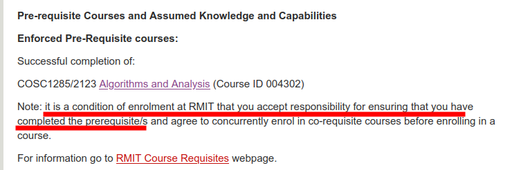
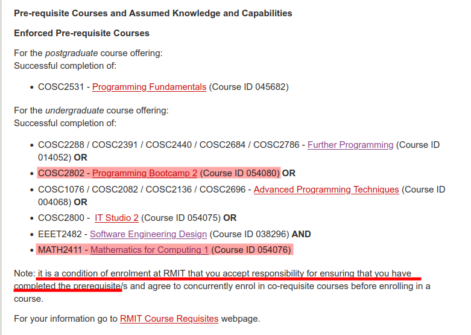
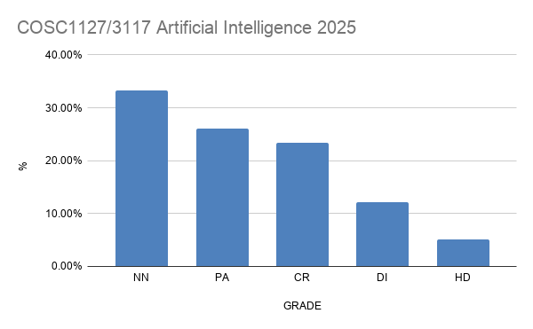
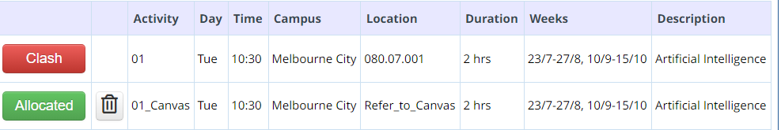
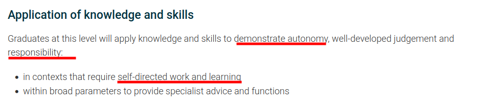
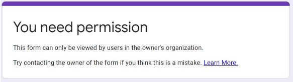

# General FAQ for RMIT AI COSC3117/1127

As any FAQ page, this page is always "under construction”. As we realise that some questions become common, we add them here...

- [General FAQ for RMIT AI COSC3117/1127](#general-faq-for-rmit-ai-cosc31171127)
- [WHY THIS FAQ?](#why-this-faq)
- [THE AI COURSE](#the-ai-course)
  - [What is this course about? What is it NOT about?](#what-is-this-course-about-what-is-it-not-about)
  - [What are the pre-reqs for AI?](#what-are-the-pre-reqs-for-ai)
  - [I have not taken A\&A. Can I take the AI course without the pre-req](#i-have-not-taken-aa-can-i-take-the-ai-course-without-the-pre-req)
  - [I have taken A\&A, but my result is RNF or DEF, can I take the AI course or have a waiver?](#i-have-taken-aa-but-my-result-is-rnf-or-def-can-i-take-the-ai-course-or-have-a-waiver)
  - [Is this course theoretical or practical?](#is-this-course-theoretical-or-practical)
  - [What programming languages are used?](#what-programming-languages-are-used)
  - [Is there any mentoring program for this course?](#is-there-any-mentoring-program-for-this-course)
  - [What version of the book is used in this course?](#what-version-of-the-book-is-used-in-this-course)
  - [What is the overall difficulty of the topics/course?](#what-is-the-overall-difficulty-of-the-topicscourse)
  - [What is the relation of this course with other (previous) courses?](#what-is-the-relation-of-this-course-with-other-previous-courses)
  - [What did other student who took the course say about it?](#what-did-other-student-who-took-the-course-say-about-it)
- [GENERAL](#general)
  - [Communication policy: I have a question, can I email you?](#communication-policy-i-have-a-question-can-i-email-you)
  - [I want to discuss something face-to-face, can I?](#i-want-to-discuss-something-face-to-face-can-i)
  - [I work outside and have other commitments, should I take this course?](#i-work-outside-and-have-other-commitments-should-i-take-this-course)
  - [Attendance: do I need to attend lectorials and tutorials?](#attendance-do-i-need-to-attend-lectorials-and-tutorials)
  - [Can I audit the course?](#can-i-audit-the-course)
  - [I am enrolled in COSC3117 (PGRD) but my Canvas says COSC1127 (UGRD). Is everything OK?](#i-am-enrolled-in-cosc3117-pgrd-but-my-canvas-says-cosc1127-ugrd-is-everything-ok)
  - [I enrolled late in the course, can you explain X, Y, and Z about the course? What should I do now?](#i-enrolled-late-in-the-course-can-you-explain-x-y-and-z-about-the-course-what-should-i-do-now)
  - [I have a question about the course, but it is not here](#i-have-a-question-about-the-course-but-it-is-not-here)
- [DISCUSSION FORUM \& FORUM ETIQUETTE](#discussion-forum--forum-etiquette)
  - [What is the Forum FAQ \& Forum Etiquette?](#what-is-the-forum-faq--forum-etiquette)
  - [Why do you use many platforms (EdStem, Canvas, GitHub, email, GH Classroom, Google, etc.) instead of just Canvas as other courses?](#why-do-you-use-many-platforms-edstem-canvas-github-email-gh-classroom-google-etc-instead-of-just-canvas-as-other-courses)
  - [I am not registered in the forum, what should I do?](#i-am-not-registered-in-the-forum-what-should-i-do)
  - [OK I am in, what are the general guidelines in short?](#ok-i-am-in-what-are-the-general-guidelines-in-short)
  - [How should we use the Discussion Forum?](#how-should-we-use-the-discussion-forum)
  - [Posting about assessments](#posting-about-assessments)
  - [My post has been declined, what does it mean?](#my-post-has-been-declined-what-does-it-mean)
  - [Why do I get all posts by email? I would rather just check the forum myself instead of getting all those emails!](#why-do-i-get-all-posts-by-email-i-would-rather-just-check-the-forum-myself-instead-of-getting-all-those-emails)
- [LECTORIALS \& TUTORIALS](#lectorials--tutorials)
  - [I have a timetable clash. There are no space available. Classes full. What should I do?](#i-have-a-timetable-clash-there-are-no-space-available-classes-full-what-should-i-do)
  - [Do we have lectures? What is a lectorial? 🎓](#do-we-have-lectures-what-is-a-lectorial-)
  - [Can I attend in-person lectorials/tutorials remotely?](#can-i-attend-in-person-lectorialstutorials-remotely)
  - [When are lecture slides made available?](#when-are-lecture-slides-made-available)
  - [Will there be lectorial recordings?](#will-there-be-lectorial-recordings)
  - [Attendance: do I need to attend lectorials and tutorials, and how important is it?](#attendance-do-i-need-to-attend-lectorials-and-tutorials-and-how-important-is-it)
  - [I couldn't attend the lectorial, can you tell me what happened and what I should know?](#i-couldnt-attend-the-lectorial-can-you-tell-me-what-happened-and-what-i-should-know)
  - [What is the `01_Canvas` session?](#what-is-the-01_canvas-session)
  - [When are we getting the tute solutions, and why not all of them right away?](#when-are-we-getting-the-tute-solutions-and-why-not-all-of-them-right-away)
  - [What about tutes, labs, consultation times? Will they be recorded?](#what-about-tutes-labs-consultation-times-will-they-be-recorded)
  - [Why don't we get the concrete final answer to questions instead of getting a rephrase of questions or a question back?](#why-dont-we-get-the-concrete-final-answer-to-questions-instead-of-getting-a-rephrase-of-questions-or-a-question-back)
  - [I cannot enroll in any tutorial, they are all full. What should I do?](#i-cannot-enroll-in-any-tutorial-they-are-all-full-what-should-i-do)
  - [I cannot attend my tutorial session, can I change to another session?](#i-cannot-attend-my-tutorial-session-can-i-change-to-another-session)
- [ASSESSMENTS](#assessments)
  - [Are assignments individual or in groups?](#are-assignments-individual-or-in-groups)
  - [I have not received the result/feedback of my assessment, why?](#i-have-not-received-the-resultfeedback-of-my-assessment-why)
  - [I was never asked these questions in an assignment or test, why?](#i-was-never-asked-these-questions-in-an-assignment-or-test-why)
  - [I enrolled late into the course, can I get an extension?](#i-enrolled-late-into-the-course-can-i-get-an-extension)
  - [Can I ask questions on an assignment/assessment in the forum?](#can-i-ask-questions-on-an-assignmentassessment-in-the-forum)
  - [Can I submit late? What is the penalty?](#can-i-submit-late-what-is-the-penalty)
  - [Can I get an extension for the assessment?](#can-i-get-an-extension-for-the-assessment)
  - [I am very busy with other commitments (work, other subjects, travel, etc.) and may not be able to make the deadline, can I get an extension?](#i-am-very-busy-with-other-commitments-work-other-subjects-travel-etc-and-may-not-be-able-to-make-the-deadline-can-i-get-an-extension)
  - [I am not available for the Exercise Challenge (EC) or Take Home Exercises (THE), can I take them some other time?](#i-am-not-available-for-the-exercise-challenge-ec-or-take-home-exercises-the-can-i-take-them-some-other-time)
  - [I have a SPC for an assessment, how does it work?](#i-have-a-spc-for-an-assessment-how-does-it-work)
  - [The room for the time-based and timetabled assessment is not comfortable; can we get a larger room?](#the-room-for-the-time-based-and-timetabled-assessment-is-not-comfortable-can-we-get-a-larger-room)
  - [Why are THE/EC not fully done on paper, or done online at home?](#why-are-theec-not-fully-done-on-paper-or-done-online-at-home)
  - [In a code assignment/project, how do I make sure I do not go against academic integrity?](#in-a-code-assignmentproject-how-do-i-make-sure-i-do-not-go-against-academic-integrity)
  - [Why did I get 57 in the assignment/project if it is just 5% of the course?](#why-did-i-get-57-in-the-assignmentproject-if-it-is-just-5-of-the-course)
  - [How do I prepare for the final in-person assessment?](#how-do-i-prepare-for-the-final-in-person-assessment)
  - [I will not be around for an in-person assessment, can I take it online or before/after?](#i-will-not-be-around-for-an-in-person-assessment-can-i-take-it-online-or-beforeafter)
  - [I would like to challenge the final assessment (review period after grade release); can I do it? 🧐](#i-would-like-to-challenge-the-final-assessment-review-period-after-grade-release-can-i-do-it-)
  - [When is the SPC for the final assessment? 📆](#when-is-the-spc-for-the-final-assessment-)
- [EXTRAS](#extras)
  - [Cannot access the Google Form, says I need permission](#cannot-access-the-google-form-says-i-need-permission)
  - [Questions about GIT?](#questions-about-git)
  - [Course Survey Experience: what? why?](#course-survey-experience-what-why)
  - [Can I know what other students though about IDM and the teacher?](#can-i-know-what-other-students-though-about-idm-and-the-teacher)
    - [Some links on the topic of student course survey](#some-links-on-the-topic-of-student-course-survey)

# WHY THIS FAQ?

This question is already answered in the [FAQ](FAQ-COURSE.md). 😉

If, somehow, you managed to get out of the [self-reference](https://en.wikipedia.org/wiki/Self-reference), then this is the list of usual questions that are asked about the course. A FAQ like this can help you find the answer right away. There are also many questions that can shed some light on the rationale of certain policies or approaches to the course. Also, by having an FAQ I am able to provide consistent and uniform answers to everyone. Of course, if you cannot find your question here, then you are invited to post it in the discussion forum. As questions become more common or usual, I add them to this list. So, maybe your new question can make it to the list! 😄

# THE AI COURSE

## What is this course about? What is it NOT about?

This is an introduction course to Artificial Intelligence (AI). It is a **breath-oriented course**, which means we cover a lot of topics, but we do not go deep into any of them. The course is about the foundations of AI, and it covers a wide range of topics, including search, logic for knowledge representation, probabilistic reasoning, sequential decision making, and reinforcement learning.

> [!NOTE]
> Machine Learning (ML) is one of the many sub-areas of AI and there is only a small component on ML, concretely we only see Reinforcement Learning (RL). If you are interested in ML itself, there are other courses that cover that (Comp ML, Deep Learning).

In the course, we see (part of) the landscape of AI, but we do not dive much into any of the topics. Different follow-up courses, like Computational Machine Learning, Intelligent Decision Making, Programming Robots, Deep Learning or Evolutionary Computation go deeper on specific areas. 

The breath-oriented style means we cover a lot and hence we jump from one topic of another, which means it is super important to stay in sync and don't fall behind. 😉

Finally, the course if foundational and it includes significant theoretical and conceptual knowledge and work. While there is significant programming, it is not a purely programming course. There will be a lot of reading, a lot of formulas, and a lot of analysis. 👍

## What are the pre-reqs for AI?

Being a last year Bachelor of CS course, this course basically relies on 3 components: _analysis of algorithms and datastructures_, _discrete mathematics_, and _advanced programming_.

To achieve this, the course has [COSC1285/2123 Algorithms & Analysis](http://www1.rmit.edu.au/courses/004302) (A&A) as a MUST ENFORCED pre-requisite:

In turn, to take (and pass) A&A, one needs to complete an advanced (second or third course) programming course and a course in discrete mathematics:

For Bachelor in CS, for which AI is core course, the pre-reqs are already built-in in the program structure.

When you take the course as an option/elective (i.e., it is not core in your program), you need to **plan ahead** and make sure that _"you ensure you have completed the pre-requisites"_ as stated above in the program guide. The alternative is to ask for an exception waiver of the pre-req by providing evidence that you have taken (and passed) an equivalent course elsewhere. Please contact your Program Manager to understand who to submit that request. 
  
> [!CAUTION]
> You MUST NOT take this course if you have not taken and passed the pre-reqs. Doing so not only puts you at a disadvantage and breaches the course prerequisites, but also imposes additional and unfair workload on the teaching team. Please contact the course coordinator if you have any questions about prerequisites to discuss.

>[!TIP]
> Sometimes the student has not the exact pre-reqs, but can request a waiver by providing evidence of equivalency. For example, a similar course done in another uni. Please come and talk to me if you think you may be eligible for a pre-req waiver.

## I have not taken A&A. Can I take the AI course without the pre-req

See question above. As the program guide states, you are to plan ahead and meet the pre-reqs, they are there for a reason of course. Note enforced pre-reqs cannot be replaced by "personal statements". The pre-reqs are there for a reason.

## I have taken A&A, but my result is RNF or DEF, can I take the AI course or have a waiver?

RNF or DEF means that you have not yet completed the course, you are basically still doing it. The pre-req means you have already PASSED it. The programs are structured in a way that you are expected to have completed the pre-reqs within the set timelines; if it takes you longer than the regular semester you would require a plan adjustment with your Program Manager.

So, you can start the course, but you will need to check the Census date and have a "plan B" at hand in case your final grade is not available or you do not pass it. An RNF or DEF is not sufficient support evidence for a waiver, which is granted when you have successfully completed an equivalence course elsewhere (fully completed, not still pending).

## Is this course theoretical or practical?

**Both!** I would say that it is ~60% theoretical/conceptual and ~40% practical. 

There will be significant programming, but to realise theoretical notions and AI algorithmic techniques, including non-classical "mainstream" programming. 

The course is not a programming course, and its objective is that you truly understand the theory and concepts behind standard AI algorithms.

## What programming languages are used?

It depends on the edition. For 2026 we will use Python and [SWI-Prolog](https://www.swi-prolog.org/) primarily, but other tools will be used as well (e.g., SAT solvers).

While you are expected to know Python and traditional programming, you are not expected to know SWI-Prolog beforehand: you will learn it in the course! 👷🏽

## Is there any mentoring program for this course?

It is usually difficult to get mentors for this last year course. In 2025, I was informed that:

> As there is no mentor has been recruited for your course Artificial Intelligence COSC1127 this semester, we regret to inform you that we are unable to fulfill your request.

So, by default, assume there is no mentorship program for the course. But I will let you know otherwise... 😉

## What version of the book is used in this course?

We use the [Global 4th edition][AIMA-BOOK] (not to be confused with the US 4th edition), which has a green cover.

## What is the overall difficulty of the topics/course?

One could argue that the course is more towards the challenging/difficult spectrum because:

1. It is an _advanced course_, expected to be taken by last year undergraduates in the Bachelor of CS program as well as postgraduate students.
2. It deals with _abstract mathematical concepts_, like logical models and formulas, recursion and self-reference, complex and infinite objects.
3. It deals with intrinsic computational difficult problems, so the techniques are not always straightforward and require _creative thinking_ to solve them.
4. It requires _problem solving skills_ to solve combinatorial decision making problems.
5. It requires _self-driven attitude_: there is significant pre-reading before the week. It is not a classical undergraduate course where the instructors yields all the knowledge during the session.
6. It covers a _wide range of topics_ in AI. This requires the student to be able to "jump" from one topic to another and keep up with the pace.
7. It is run by a _demanding teacher_ who pushes students _hard_. 🫷

Said so, "difficult" is very personal and depends a lot on the background, motivation, and dedication of each student.

One initial test is to read Part I.1 and I.2 (Sets & Logic) in the Book of Proofs:

<https://www.people.vcu.edu/~rhammack/BookOfProof/>

and see how it goes. If you don't feel comfortable with that, then this may be a signal 📶

Another objective reference of difficulty could be the grade distribution. In general, **the course has had ~10% HDs and ~30% NN failures**. So, it is hard to get an HD and if one doesn't do the work to a good standard it is easy to fail it. 🤷 

These were the results for 2025 edition:

Thus, in general, if you are looking for a course to that is not too demanding (maybe because you are already taking difficult courses in the semester), then _this may not be a good choice_. However, if you have motivation and time space to dedicate, I suspect you may learn a way of thinking and solving programs that you have never been exposed to before.

Nonetheless, you are happy to come to chat with me and we can discuss your _own case_. Please drop by my office or send me an email for an appointment; I am usually in my office available on Mondays, Wednesdays and Fridays. Come!

Remember you can also check what other student said about the course, refer to [this question](#can-i-know-what-other-students-though-about-idm-and-the-teacher).

## What is the relation of this course with other (previous) courses?

The AI course is related to at least:

1. **Math courses:** AI uses math as the main tool, both to model problems and solve them. 
2. **Algorithms & Analysis:** AI uses algorithms to solve problems, and it is important to understand the usual algorithmic techniques (e.g., dynamic programming, graph algorithms, divide-and-conquer, etc.) as well as the analysis of them, such as asymptotic complexity of algorithms with Big-O notation.
3. **Computing Theory:** AI touches on ver difficult or (almost) impossible computational problems, so it is important to understand the the notion of computability, the limits of computation, and the complexity of problems (e.g., P and NP). 

The natural progression is (MATH + PROGRAMMING) --> ALGORITHMS & ANALYSIS --> Computing Theory --> AI.   

## What did other student who took the course say about it?

Check [this question](#can-i-know-what-other-students-though-about-idm-and-the-teacher).

# GENERAL

## Communication policy: I have a question, can I email you?

**Communication/email policy:** Except for personal issues, _all_ electronic communication must be directed to the [EdStem Discussion Forum][EDSTEM]. 

I only use email for limited communications regarding **personal circumstances** (in which case email is just used to arrange a face-to-face meeting). In particular, I will not respond by e-mail to any requests to clarify lecture, tutorial, assessment, or administration questions. 

Please use lectures, workshops/tutorials, and labs first, and discussion forum second, for all such questions so that a _fair course is run_ and all other fellow students can benefit as well: **_sharing is caring_**.

Do not be afraid to post any question, no question is stupid! Help us to help you 🫵!

Said so, your questions need to professional and respectful, properly formulated and, importantly, show you have done your part. Just asking for “help” or for solutions/insights on assignments is not good, as it shows little or no effort. We are here to help you learn, not to help you collect solutions or answers. 

>[!IMPRORTANT]
> It is important you follow proper the [Forum Etiquette][FORUM-ETIQUETTE]; please read the 13 points there before posting: do not make us tell you to read it. 😉

To benefit from others, please ensure that you _regularly check_ the course website and attend lectures and tutorials.

Check [Course Communication Policy here][COM_POLICY]

## I want to discuss something face-to-face, can I?

**Of course!** I am happy to talk to you face-to-face and without a keyboard in the middle! Workshops are the best place for this course, I am there 3+ hours. If you need more privacy (e.g., discuss personal matters), then please send me an email and we will arrange an appointment in my office, no problem!

However, if what you are after is technical support with the course, then you should use the plenty of support already available in workshop sessions, that is exactly where we have tutors ready to help in a one-to-one fashion. Go and ask your question there, **help us to help you!** Of course, simple question and clarifications can also be asked in the course forum! So plenty of opportunities to get help. 

## I work outside and have other commitments, should I take this course?

It is very difficult for me to answer this question, every student's circumstances and skills are different.

What I can say is that this course is _not_ one you can take "on the side": it does indeed require **significant commitment**.

If you have limited time to devote to course sessions (lectorials and tutorials), or don't have much flexibility or bandwidth to work with others, think carefully about whether you want to take the course, to avoid pitfalls, unnecessary stress, and negative impact on others. There is a significant amount of reading, coding, and maths involved. In most cases, all that requires _time_ and _motivation_.

## Attendance: do I need to attend lectorials and tutorials?

Check [this question](#attendance-do-i-need-to-attend-lectorials-and-tutorials-and-how-important-is-it) for a detailed answer.

## Can I audit the course?

**Fine with me!** ... as long it is feasible in the course (e.g., there is a seat in the room!) and you understand that:

1. You will not be assessed on your work, formally or informally. The tutors are there to help the enrolled students. You may not take any assessments, in-person or not. But of course you can do it by youself!
2. You may not be enrolled into the formal systems of RMIT for the course.

In general, auditing means attending the lectorials, which arguably is what you wouldn't be able to get elsewhere, the sublteties, "story", and interactivity with others.

## I am enrolled in COSC3117 (PGRD) but my Canvas says COSC1127 (UGRD). Is everything OK?

Yes, no need to worry. This is just a Canvas "hack" for cross-listed courses. We maintain only one site (COSC1127's one), but everybody in the course can access it. No problem.

## I enrolled late in the course, can you explain X, Y, and Z about the course? What should I do now?

First of all, I assume you have already discussed your late enrolment with your Program Manager: this is important. We assume students have been diligent beforehand and are fully enrolled and ready by at least Week 0, if not earlier.

Enrolling late means you have missed content and information about the course, and possibly assessments. This is fine as long as you **have the OK of your Program Manager** and take **full responsibility** for entering the course late, _without shifting the burden onto the teaching staff_.

Think about it: joining a course in week 2 or 3 is like arriving 15 minutes late to a meeting with lots of people -- you do it carefully, trying not to bother others, and accepting _full responsibility_ for having arrived "late". Would you stop the meeting and ask, _"can you please tell me what you've been discussing so far?"_ Surely not... ;-)

So this means that:

1. The teaching staff will not go over the course logistics and information on a per-student basis for a student who has joined late (and missed the first week of information and course overview).
   - This means you will have to gather the information from the first weeks yourself, by reading the online course pages, going through the relevant forum posts, and watching the videos and recordings. Talking to fellow students who are in sync with the course will probably help too.
   - Please don't ask the teaching staff to go over the course details _again_ unless you truly have to -- and if you do, please do it only _after_ you've processed everything yourself, and do it _in person_ during lectorials, tutorials, or consultation time. This shows you're genuinely making an effort to catch up (and the teaching staff will be more sympathetic as a result). 😄
2. You will have to catch up with the technical content of the course. This is an intense course with significant reading allocated every week, starting from week 1. This means you will need to put in significant effort to sync with the course.
   - Entering in week 2 or 3 should be doable with effort; after that it becomes very challenging and risky.
3. You are not entitled to any extension or redo of assessments that have already run or been distributed by the time you enrol.

In summary, the course is intense even for those who start on time, and every week matters. I am fine with you joining late after discussing it with your PM, as long as you **take full responsibility** for that late start. I am also happy for students to contact me before they are formally enrolled, while they wait for the administrative process to conclude; this lets them stay in sync with the course until the paperwork is sorted out.

Hope this is clear, and all the best in the course!

## I have a question about the course, but it is not here

If you have any questions about the course that you think other fellow students may be also interested to learn, please post it in the forum!

# DISCUSSION FORUM & FORUM ETIQUETTE

## What is the Forum FAQ & Forum Etiquette?

It is a set of questions and guidelines how to use and behave in the forum professionally. Please see dedicated [Forum FAQ & Etiquette][FORUM-ETIQUETTE].

## Why do you use many platforms (EdStem, Canvas, GitHub, email, GH Classroom, Google, etc.) instead of just Canvas as other courses?

This is a valid question that some student have, as they see themselves learning a few new platforms for the course.

>[!IMPORTANT]
> For many years I had to explain to some students (the wide majority understood right away), _why_ I was using EdStem rather than Canvas. Not anymore... As of 2026, the School of Computing Technologies (SCT) has adopted EdStem formally, recognising its superiority over Canvas. As many other courses keep switching to EdStem, it became quite obvious. So, I am not anymore an outlier... 👏
>
> So, the text below is not needed anymore, but I will keep it here for historical reasons or in case you are interested. 😄

First, be assured that the use of several platforms and tools is not random: _there is a rationale with significant thought, experience, and work behind_.

In general, for this course we are mostly using EdStem and GitHub alone, that's all, with occasionally 2-4 emails for details on the results (~1 email per project). That does not seem to be an overload for uni-level.

More broadly, I am on the opinion that it is actually _not_ so good for the student learning to prioritize "uniformity" due to (at least) two reasons:

1. First, it is just **impossible and unrealistic in Computer Science**: there are lots of technologies and systems around that are all useful in their own way and that different people use, be Github, Slack, Canvas, Latex, email, Discord, Edstem, Travis, Jira, stack-overflow, Menti, etc.
   - A good CS practicioner should not only be versed on many of them, but also flexible adaptive enough to learn and manage new ones as they are needed or requested (e.g., at work or on an open-source project).
   - As a student itself put it in a feedback: _"I like the fact that our submission is done through GitHub as it provides some industrial sample."_
2. As an educator, I _personally_ **don't believe in a "McDonald"-type uniform approach to education and learning**, under which everything is in the same place, color, format, size, and taste 😆.
   - While uniformity may provide a sense of "safety" to students, it does not train them to be _flexible_ and _adaptive_. It also does not recognise that there are indeed different teachers and different styles of teaching, like in the real world.
   - So, I do think it is beneficial for students to be exposed to different style of teachers and teaching styles, so they can learn many ways, not just "one way". 😃

Now, the above **does _not_ mean that one can use many different things/tools/platform just for the sake of making things non-uniform!** There must be a technical reason behind! The point is that _if_ there is a tool X that solves problem A better, then fine, let's use X and accept that not everything comes in the same way.

Note that **sometimes a student may not _directly_ understand** in which sense an option is "better", but here is where we expect students to trust the expertise and experience of the teacher, as much as one trusts a pilot when boarding a plane!

- For example, a student may not understand why we don't use Canvas discussion forum and the fact that forums like EdStem and Piazza not only increases engagement a lot (between 7x to 10x), but also are much much more productive for the teaching staff, which in turn allows staff to answer way many more questions and quicker, thus providing better service for more students.

Finally, I note that this is **MY approach/view/perspective to Computer Science and Education** at uni level, this part of my "teaching style".  I accept others have a different view and see more benefits in prioritizing uniformity above everything else.

I hope this shed some light on the issue, and of course if a student has a better way/tool to do something within the course, **I am always open to constructive suggestions** and I will, without hesitation, adopt them if they are provably better and accessible.

## I am not registered in the forum, what should I do?

At the start of the course, I will send an invitation to all enrolled students in the course to join the course forum. If you receive that email 📧 and you are enrolled, please accept the invitation. You may want to check your spam folder, sometimes you can get surprises! 😉

If you still cannot find the invite, please email me and we will sort it out. 👌

Please remember to enrol only with your RMIT student account, not with your private account. Private accounts will be removed from the forum.

## OK I am in, what are the general guidelines in short?

First, students are expected to read the posts from staff at least once a day. Important announcements will be pined and marked to be also sent by email, but this will only work if you have your notificaitons in EdStem enabled!

Here are some guidelines you should follow:

- **Configure** your EdStem's notification settings. By default, EdStem emails you when there are new topics and posts. This can get overwhelming when the class is busy. Fortunately, EdStem allows you to configure how frequently you get emails:
   - Click on the gear icon at the top right corner of the screen
   - Choose “Account/Email Settings”
   - Scroll to “Class & Email Settings”
   - Click “Edit Email notifications”
   - “Smart Digest” is a good choice for most people.

  💡 It is wise to leave the “For updates to Questions or Notes you follow” to “Real Time” unless you check EdStem more frequently than you check your email.
- Search before you post.
- Heart questions and answers you find useful.
- Answer questions you feel confident answering.
- Mark as Resolved questions you have asked and that have been successfully answered.
- Make sure you read all posts under the "Reading List" or "Announcement" tags. These are mandatory posts to read.
- Read and understand the [FAQ Forum Etiquette](https://docs.google.com/document/d/1HdrY91LIPRZOEni_jsCwmN8Oc8MrUzljen6qHzbtQeU/edit#heading=h.9txqszvrzybd).
- Share interesting course related content with staff and peers.
- For more information on Ed Discussion, you can refer to the [Quick Start Guide](https://edstem.org/quickstart/ed-discussion.pdf).

## How should we use the Discussion Forum?

In general, the forum is a place to enquire about _specific_ issues you may be struggling on, clarifications, or things that you are curious about. The forum can also be used to share interesting things related to the course that you think other students may like. 

In general, your posts should have a clear and precise question and not be too long. If your post is just an open question or something not related to the course, then it probably should not be a post at all. The forum should not be used to post (your) solutions or processes, or to ask for them.

When you reply, do not ever paste your solution. You can give some hints, or show a particular fragment of your approach to highlight the strategy (e.g., one rule of your grammar), or point to some part of the book, slide, or some web page that may shed some light, but do NOT just throw your complete solution to the forum. As much as you want to help your fellow students, doing so is counter-productive.

Thanks!

## Posting about assessments

Do not ever post any information on the forum that may disclose how to solve a question or what the solution may be, regardless of whether it is correct or not. The post is not the place to make public what you are doing or how you are thinking. Those posts may disclose the solution or confuse other students in the wrong direction, and they may constitute a case of cheating.

You can, however, ask for clarifications on what is being asked, for example, whether a formal proof is required in a given exercise or to clarify certain notation. Any post discussing possible solutions or strategies may directly be considered a case of plagiarism, see above. If in doubt, do not post and ask the instructor or post a private post (if the teaching staff consider it safe, they will make it open).

## My post has been declined, what does it mean?

Instructors can decline threads to maintain the quality of discussion and to remove low-effort questions. Declined threads are not visible to other students: the thread becomes private and locked.

When a post has been declined, it often means is not appropriate.  Instructors may optionally leave a message explaining why the thread was declined and suggest changes that should be made to improve the thread. Reflect what was the problem and re-post if necessary.

## Why do I get all posts by email? I would rather just check the forum myself instead of getting all those emails!

By default, EdStem emails you when there are new topics and posts. This can get overwhelming when the class is busy. Fortunately, EdStem allows you to configure how frequently you get emails:

- Click on the gear icon at the top right corner of the screen
- Choose “Account/Email Settings”
- Scroll to “Class & Email Settings”
- Click “Edit Email notifications”
- “Smart Digest” is a good choice for most people.
- It is wise to leave the “For updates to Questions or Notes you follow” to “Real Time” unless you check EdStem more frequently than you check your email.

# LECTORIALS & TUTORIALS

## I have a timetable clash. There are no space available. Classes full. What should I do?

_If you encounter timetable clashes or no seats available, it is important that you get them resolved before classes start each semester._

The timetable is managed centrally and is developed to ensure core courses are clash-free based on the year and semester of the program. It is not possible to cater for every elective option or non-standard enrolment (e.g. cross-year enrolment or repeating courses). If you have a clash, you should first review your program plan/structure to determine if alternative courses are available to you. You may move courses around (as long as you meet the pre-requisite requirements).

The timetabling team monitors the capacity issues and increase the seat availability, however, it is important to notify them if there are no seats are available. Please lodge a service request via, [RMIT Connect Service Form](https://www.rmit.edu.au/students/contact-and-help/connect/ask-about-class-timetables).

[myTimetable](https://www.rmit.edu.au/students/my-course/class-timetables) does allow you to de-allocate from any class you may not be planning to attend. Before de-allocating any class we strongly advise you to ensure that, for example, you check pre-requisites and other program progression requirements. Please check your program canvas shell for **recommended study plans** for Feb intake and July intake.

If you have any timetable issues, first, visit RMIT Student Timetable site:

[https://www.rmit.edu.au/students/student-essentials/class-timetables/higher-education](https://www.rmit.edu.au/students/student-essentials/class-timetables/higher-education)

and, more specifically, FAQ page:

[https://www.rmit.edu.au/students/student-essentials/class-timetables/class-timetable-faqs](https://www.rmit.edu.au/students/student-essentials/class-timetables/class-timetable-faqs)

If you still cannot resolve your issue, please lodge a service request via, RMIT Connect Service Form:

[https://www.rmit.edu.au/students/contact-and-help/connect/ask-about-class-timetables](https://www.rmit.edu.au/students/contact-and-help/connect/ask-about-class-timetables)

Please note that I, your program managers, or your course coordinators are unable to resolve your clashes ourselves. The best channel is to lodge your request via the above form.

## Do we have lectures? What is a lectorial? 🎓

**No! Ouch, what, no lectures?**

Following RMIT directions, courses are not meant to run standard lectures, in which the instructor presents the material of the week from scratch, without assuming any previous knowledge from the student. In a standard lecture, the instructor starts with the motivation of the content (e.g., why search is important and where it can be used) and then provides all definitions, concepts, and notions from zero (e.g., what is a state, what is the search tree/graph, a detailed explanation of each search algorithm, the complexity of each algorithm, etc.). So a student could rock up to the lecture and listen to the lecturer provide all the information from the beginning.

None of that will happen in this course. Instead, **lectorials are interactive and more targeted teaching sessions**. Importantly, students are **expected to have already read** the material assigned for the week (mostly from the course book), so that the instructor can focus on the more crucial aspects of the content that students may not be able to gather on their own. The objectives of a lectorial are then to:

1. 🌐 Provide the _context_ of the material, within AI, CS in general, and in terms of applicability domains. For example, why search is a powerful technique, what is the history behind it, where it is used, and what kind of problems can be tackled via search.
2. 🤔 Discuss some _subtle and general "pain points"_ of the content. For example, why the complexity of IDS is not as bad as it first appears.
3. 💬 _Answer specific questions_ students may have from their pre-reading of the material. For example, a student may wonder why DFS may not find a solution.
4. ✏️ Work through, together with the whole class, some _sample exercises_. Students are given an exercise and some time (say 5'-10') to solve it, perhaps in groups. The class then reunites and goes over the exercise together.

As you can see, points 1-4 make no sense for a student who rocks up to class without having pre-read the material in enough detail. A student who doesn't know what a "state" or "search space" is, or what DFS or IDS is, won't be able to take advantage of such a lectorial session, since the instructor will not explain any of those concepts -- they are assumed to be already known.

> [!NOTE]
> That said, I personally agree with current educational standards (e.g., the Science of Learning) based on cognitive-science research on how students learn. In that approach, **explicit teaching** is important early stages of learning, among other things, to reduce cognitive load. So, lectorials will still devote significant time to points 1 and 2 above, where the key points of the content are explicitly communicated.

## Can I attend in-person lectorials/tutorials remotely?

No. RMIT is committed to on-campus experience and there is no _hybrid_ teaching anymore for the course.

Please refer to [this question](#attendance-do-i-need-to-attend-lectorials-and-tutorials).

However, lectorials (not tutorials) will be recorded for later reviewing, see question below on that.

## When are lecture slides made available?

Slides play a much less important role in a lectorial than they used to in lectures. They are no longer self-contained and comprehensive; they may only contain news or some general information used by the instructor, but not technical details or comprehensive coverage.

That said, when the slides do contain useful information (e.g., news or specific technical points discussed), they will be provided after the session on EdStem.

## Will there be lectorial recordings?

Lectorials are automatically recorded via **Echo360**, yes.  That said, there is ALWAYS plenty of space in the room (which is great!), so **we invite and encourage students to attend in person**, rather than watch the recording later, mostly for three reasons:

1. The recordings are **out of my control** 🤷, and in the past there have been numerous issues, including missing recordings, muted recordings, noisy or very low audio, no video, truncated videos, missing projection, etc.  
2. There can also be privacy issues (e.g., students asking personal questions close to the mic) that need to be addressed before a recording goes out safely, so recordings will not be available right away, but after they have been reviewed and curated.
3. More importantly, recordings are **not** a professionally produced/curated video like the ones you would find in a polished online course. They are a raw capture of a live, in-person session, and watching a static camera feed of someone talking for two hours, alone, on your laptop, is a very different (and much more boring) experience than "being in the room" 😫. Note that in the lecture, the instructor walks around the class and interacts with students (whose voices will not be recorded), and there will be gaps, etc. Very boring indeed to watch raw...

In my experience, most students who plan to "just watch the recording later" end up dropping the ball: the recording sits unwatched, or gets abandoned a few minutes in, and the content never actually gets absorbed. 

Which brings us to the next question...

## Attendance: do I need to attend lectorials and tutorials, and how important is it?

You must come? **_No_**. You should come? **_Yes!_**

Uni is not school: except for in-person assessments, there is no direct penalty for not attending. But while a minimum attendance standard is not compulsory, **non-attendance may seriously jeopardise your chances of success in this course**:

- Missing in-person assessments (e.g., Exercise Challenges or marked class quizzes) results in failure of that assessment, with no replacements.
- The teacher will generally identify subtle technical points in the material, discuss them, and give insights that would be quite difficult for a student to grasp alone (most likely they'll be missed entirely).
- In the lectorial, the teacher puts the material in context (why? what? when?), which helps ground the technical content and supports understanding and motivation.

So, we strongly suggest attending ALL lectures and ALL tutorials to maximise your chances of success in the course. Besides these technical aspects, there are also other very good reasons to attend in-person, which I'm convinced **produce better outcomes** in general:

- Studying at uni is a **_privilege_** that few of us have, and usually only once in a lifetime, so it deserves to be honoured.
- A unique aspect of being there is the chance to be taught **_interactively_**, on the spot, by academics who are also scientists in the field: asking questions, participating in discussions, and clarifying doubts in real-time. Non-verbal cues from the lecturer -- emphasis, gestures, tone -- also help you better understand and retain the material.
- It's a chance to interact with fellow students who are in "the same learning boat": they could become your new friends, future colleagues, or even partners in life (many find their significant other at uni!). Together you build a **community of learners** that reduces the cognitive load of studying alone, and brings fun and a sense of "team".
- Attending in-person promotes **_active listening_**, with the physical environment minimizing the multitasking and distractions that come with watching a video at home.
- **Structuring your day** around these sessions helps with time management. Watching recordings "later" often turns into procrastination, or never, especially without a deadline forcing the issue -- and unlike a live lecture's natural pace, pausing and rewinding a recording can feel efficient but adds **cognitive overhead**.
- **Being there** means you don't have to worry about the recording failing or being of poor quality.

All this makes uni unique and different from watching a (not so great) video or learning by yourself, so not attending gives up what is probably the main feature of studying "on campus" -- so, be wise and don't miss out 😉

Over the last couple of years, during COVID times, we experienced first-hand how limited the online experience is, and how much better, more fruitful, and more enjoyable in-person learning is. I hope this motivates us all to make that extra effort to "be there". It enhances not only your own experience, but also that of others -- "being there" contributes to everyone's learning.

> [!IMPORTANT]
> Note that, from 2023, RMIT is committed to _in-person teaching on campus_. The course will NOT run online or in hybrid mode anymore, as it did in previous years due to COVID. This means you should _not_ expect that what happens face-to-face (in-person) will have an "online replacement" (be it streaming, recording, replacement sessions, etc.). This doesn't mean there will be no online presence -- there will be (e.g., forum, GitHub) -- but as additional and complementary resources, not as replacements or substitutes.

Being a uni course, we expect students to be **more autonomous** in this decision than school students, and we understand everyone's circumstances are different. It is ultimately _your_ choice whether to be there or not. But overall, the recording is, in my view, a second-rate version; OK for some, but not the "quality" product 😉.

**Maybe this is my recommendation.** Two years ago, in the second-to-last lecture, a student came up to me after class and said:

> I didn't realise until now that the live lectures were so much better than watching the recordings, so much better. I have been watching all the recordings after class, but this is so much better and fun. I really enjoyed it, but I feel bad I didn't come from the start.

This actually happened! I thanked the student for his words; of course I felt good that he liked it, and valued his positive feedback. It was also good that he managed to catch at least two lectures (he came back for the final one). However, I felt sad that a good, motivated student like him had missed the opportunity earlier... 😢 **Opportunities are to be taken when they arise.**

So, **maybe make the effort to come for the first few, and then decide?** The room is really beautiful (a total privilige), eh... Hope this provides some context to help you make a better decision, but ultimately it is yours 🙏.

So, hope to see you in the room, interacting with teachers and fellow students! 👏

## I couldn't attend the lectorial, can you tell me what happened and what I should know?

The short answer is: _no_. 😉

We understand that sometimes things come up and you may not be able to attend a class or workshop. However, with a course of over 400 students, it is unfortunately **not feasible** (nor a smart use of limited resources) for teaching staff to individually recap content from missed sessions on request.

It is **each student's responsibility** to catch up on missed material independently. We recommend reviewing any shared workshop slides, notes, and recordings (if available), or speaking with classmates about what was covered. If, after doing so, you have specific questions about the material, we are more than happy to help clarify them in tutorials.

## What is the `01_Canvas` session?

The additional "Canvas" tag means the lectorial will be recorded: 📹

Note this does **not** mean hybrid concurrent teaching; RMIT stopped that several years ago. It was used during COVID as an emergency measure, but is no longer relevant.

> [!TIP]
> Regardless of your session, there is always a LOT of free space in the classroom, so you are always welcome to join (and use recordings as a backup for later reviewing if needed). See the next section for "recordings" of the session.

## When are we getting the tute solutions, and why not all of them right away?

The short answer is that we aim to actively promote **"production-based"** learning rather than **"consumption-based"** learning. Seeing a solution does not produce the same learning as working one out yourself. As educators, we want to set up the mechanisms that best support (and promotes!) active, production-based learning for the majority of students. Nothing is perfect and no single approach works for everyone, but we are teaching a large class rather than a small group, and it is our responsibility to support the learning of the _majority_.

Solutions to some tute sheet exercises will therefore be provided **one week after the tute**. This gives students the space to attempt the questions _by themselves_ first. Releasing solutions right away would undermine this for many students: having the solution isn't the useful part; _arriving_ at it is (or at least giving it a genuine try!). That said, some exercises are worked through in lectorials, and by attending tutorials you'll get a good sense of how your answers are tracking.

Even when solutions are released, many questions will carry _hints_ or _partial_ solutions, rather than full solutions. This is to encourage students to think critically and work through problems independently, rather than relying on provided answers. The hints or partial solutions should give you the necessary "push" for you to solve the corresponding task, and by doing that we foster a deeper understanding of the material and develop problem-solving skills that will be valuable in exams, future courses, and your future jobs.

> [!TIP]
> In tutorials, you can always check your solution with a tutor, provided you show evidence of having made a genuine effort. Again, the goal is not to hand out solutions for passive consumption, as that reduces the chances of genuine learning.

## What about tutes, labs, consultation times? Will they be recorded?

Tutes, labs, consultation times, and ad-hoc online meetings/sessions are all interactive and spontaneous in nature. They are _not_ curated (as YouTube channels often are), and there are often many people participating -- students plus teaching staff. We want to make these sessions as welcoming and inclusive as possible, without fear of saying the wrong thing or making mistakes. 🤗

So, they will not be recorded:

1. We want to promote **active contribution** and **participation**. There is no contribution when one just watches what others have done. To contribute, one needs to "be there".
2. It has become clear that recordings make some people who **would otherwise attend**, not attend. A bad outcome indeed.
3. Most importantly, we aim to **remove any potential obstacle** to people talking, asking (even silly questions), making mistakes, answering (even if wrongly), etc., without feeling that they've been recorded and will then be watched by many others.
   - This is also one of the main reasons we use EdStem: it allows _anonymous posts_, and this has been shown to increase participation a lot!

This rationale is intended to _promote_ a better learning environment overall. Of course, nothing is perfect and, analogous to programming languages, we can only _promote_ a paradigm (not fully enforce it!). 😉

In other words, we want these sessions to feel as close as possible to "being all together in the room physically", and one would never record those meetings; it would feel very weird and uncomfortable, right?

## Why don't we get the concrete final answer to questions instead of getting a rephrase of questions or a question back?

We -- lecturers and tutors -- try to provide guidance so that students arrive at the answer by themselves. In other words, our main objective is for you to get to the answer; we are there to _support_ you when you get stuck, by helping resolve whatever issue we believe is obstructing your progress toward the right answer. In a way, we try to apply the ["Socratic method"](http://en.wikipedia.org/wiki/Socratic_method), a form of inquiry and discussion based on asking and answering questions to stimulate critical thinking. Granted, we may not always do a great job at that! 😅

It would indeed be much easier for us to just give you the full answer/solution, and you might feel relieved to have the correct answer on the spot. We (generally) know the answer. However, we believe that would do you no favours. You won't have learnt much by simply hearing the solution from us right away.

Finally, remember that in the tests you will be on your own, so you will have to come up with your answers entirely by yourself. This will be very difficult if you're not used to such challenges -- and we would be doing you a disservice if we didn't push you to get to the right answer yourself. 💪

## I cannot enroll in any tutorial, they are all full. What should I do?

Nothing. 😉

Just show up to _any_ tutorial you want to go, or many if you want to go to many sessions! I want students to take the most out of it, so go ahead and use as many opportunities as you can!

## I cannot attend my tutorial session, can I change to another session?

YES, and if you want to go to more than one tutorial, feel free to do so, the more the better! 🥇

# ASSESSMENTS

## Are assignments individual or in groups?

All assessments in the AI course are individual. This means you have full ownership of your work and can plan by yourself! 👍

## I have not received the result/feedback of my assessment, why?

The first thing to check is how many days have passed since submission. In general, and as [per RMIT guidelines](https://www.rmit.edu.au/students/my-course/assessment-results/assessment), assessment results will be provided within _10 working days_, so if that time has not passed yet, just wait:

> You should expect to receive progressive results and feedback within 10 working days of your assessment due date and submission. You can also request feedback if you feel it has not been provided during the stated time frame, or in one of the various formats outlined below.

So, you can enquire about your results _provided the 10 working days from submission have already passed_. Note that, as stated in the link above, **feedback may be provided in different forms**, not just your final mark. For example, progressive feedback may be given in class or discussions or tutorials (e.g., common pitfalls or working examples), or through the forum. If you have not seen or received _any_ feedback whatsoever after 10 working days, please contact the teaching staff.

If more than 10 working days have passed, check for announcements regarding results. If it's taking longer than that, it has probably already been announced widely to the course. It's also common for teaching staff to make it clear once all results have been released. If you still haven't received yours after that, it's time to contact the teaching staff!

## I was never asked these questions in an assignment or test, why?

That's correct, and it's one of the objectives of assessment. We aim to go beyond the lowest levels of the [Bloom Hierarchy](https://cft.vanderbilt.edu/guides-sub-pages/blooms-taxonomy/) (_remember_ and _understand_) and achieve higher-order levels of learning: applying and creating new solutions.

One important skill (a very important one!) is being able to handle new problems and challenges using the knowledge and problem-solving strategies you gathered earlier. It is not enough to _just_ solve questions you've seen before. In particular, if you want to excel, you must be able to welcome and handle novel challenges.

## I enrolled late into the course, can I get an extension?

Enrolling and entering the course late does not, by itself, provide grounds for an extension, and extensions will not be granted for that reason.

When a student enrols late, it is **their** responsibility not only to catch up by themselves, but also to deal with any impact on assessments that may have already occurred or may be on the way. Assessments are run according to the course schedule for everyone; there are no multiple starting points depending on when a student enrolled.

Because of this, it is essential that, before enrolling late, students discuss the potential impact, consequences, and risks with their Program Manager, and obtain explicit permission to do so.

In general, enrolling during the first week, and even the second, has little if any impact or risk, as long as sufficient extra time is invested to catch up. Entering the course in week 3, let alone later than that, is not recommended and is very risky, on top of probably having already missed a few assessment pieces.

Please also refer to [this question](#i-enrolled-late-in-the-course-can-you-explain-x-y-and-z-about-the-course-what-should-i-do-now) above.

## Can I ask questions on an assignment/assessment in the forum?

Please refer to the entry [Posting about assessments][FORUM-ETIQUETTE] in the Forum FAQ.

## Can I submit late? What is the penalty?

Yes, for assignment projects only (not timed and timetabled assessments), you can submit late with, albeit with a penalty. Assignment projects received late and without prior extension approval or special consideration will be penalised by a deduction of 10% of the total score possible per calendar day late for that assessment.

>[!Warning]
> Late submissions are only allowed to assignments and projects, not for timed and timetabled assessments (e.g., in class quizzes, tests, challenge exercises, or take-home exercises). These must be done during the time-frame allowed and no late submission is permitted.

## Can I get an extension for the assessment?

**Yes, but only in some cases.** As per policy, extensions are reserved for _extreme cases that are totally outside the control of the student_, such as health issues, bereavement, being the victim of a crime or other trauma, severe disruption to living arrangements, or financial hardship. Standard external commitments (e.g., work, other courses, travel, etc.) do not warrant an extension; please refer to [this question](#i-work-outside-and-have-other-commitments-should-i-take-this-course).

The dates of all assessments in this course are given well in advance. Note also that when an assessment has a 2-week window, it does not mean it requires 2 weeks of full-time work: it is a flexible window so you can plan your commitment within that timeframe. So, plan your work early around your commitments and workload, start on assessments _early_, and submit them well before the deadline -- preferably at least one or two days early. Working and submitting close to the deadline is risky, and you may fail to submit on time, for example due to loss of internet, laptop problems, server delays, heavy workload, late enrolment, external commitments, etc.

However, if you know you will be unable to complete an assignment due to illness or personal circumstances outside your control, please contact your lecturer immediately for special consideration and submit the [Application for Extension of Time for Submission of Assessable Work Form](https://www.rmit.edu.au/content/dam/rmit/au/en/students/documents/my-course/assessment-results/application-extension.pdf):

- **Evidence will be required** (e.g., a medical certificate).
- As per policy, you must submit your request **at least one _working_ day before the original due date**. Do not expect us (or other teaching staff) to be working on weekends or after hours. Requests received close to the assessment date (or after it!) will generally not be accepted, except in the most extreme circumstances (e.g., hospitalisation). We encourage students to plan days and weeks ahead, and discourage last-minute pleas for help.
- **Do not just stop working and "wait" once you've submitted your request.** First, you don't know if it will be granted. Second, we expect you to still be working on the project, and the extension will be assessed on that basis. Keep working, and submit as early as you can, even before receiving the notification and decision.
- Evidence of sustained work on the assessment will strengthen your case.
- You may be required to explain how the extension will affect your other deadlines, for this and other courses. We are always careful to ensure that any extension does not impede too much on other assessments and does not have a domino effect.

Each request is considered on an individual basis. If approved, the deadline for the assignment will be extended. If denied and the assessment is missed, you will unfortunately receive a zero for that assessment. Remember, though, that it is always possible to submit late.

> [!IMPORTANT]
> The instructor can only handle simple, "obvious" requests -- those under 7 days that can be assessed quickly based on the evidence (e.g., a medical certificate indicating the length of impact). Longer or more complex requests, which require carefully assessing the evidence and situation, cannot be handled by the instructor and may need to go through RMIT's formal process for [Special Consideration (SPC)][RMIT-SPC].

> [!IMPORTANT]
> Because of the nature of many project assessments and the quick release of results, any non-short-term SPC will probably take the form of an **Equivalent Assessment** -- that is, another assessment later on that assesses the same content but possibly in a different way. In most cases, this will involve a pre-arranged, in-person, 1-2 hour closed-book assessment with the instructor (e.g., a set of exercises to complete).

> [!IMPORTANT]
> If your application relates to a request for an extension of time for submittable work (such as assignments, projects, or essays) to either the instructor or the SPC team, you are expected to continue progressing that work and submit it as soon as possible while your application is under consideration. Do not just wait idle for the notification to arrive.

## I am very busy with other commitments (work, other subjects, travel, etc.) and may not be able to make the deadline, can I get an extension?

Only for unexpected circumstances outside your control (e.g., illness) will extensions or equivalent assessments be granted; see the question above.

For other situations, we expect students enrolled in the course to _have arranged all their other commitments_ (e.g., work, other courses, family, trips, etc.) beforehand, to make sure they can carry out the course _under the planned schedule_. Ultimately, meeting deadlines does matter, and is part of demonstrating the course's [AQF Level 7-9](https://www.aqf.edu.au/framework/aqf-levels#toc-aqf-level-7-criteria-3) expectations:

Note that we have 400+ students, so many could claim time constraints for a variety of reasons. Besides the unmanageable workload this would imply (reviewing and tracking each case, marking at different times, releasing results at different times, etc.), I am _not able or allowed to arbitrarily judge_ which cases are okay and which are not: I would undoubtedly make mistakes and end up treating students differently, _which would put me in a very risky position on fairness grounds_.

Also, note that the difficulty of each assessment has been planned to be achievable within the given time frame, so claims about the difficulty of the task will not be entertained as grounds for an extension. Pushing one deadline for many students would not only complicate the running of the course, but would also put students in a more difficult position for upcoming (more demanding) assessments.

## I am not available for the Exercise Challenge (EC) or Take Home Exercises (THE), can I take them some other time?

**No.** These timed and timetabled exercises (both during the teaching semester and the final one) will happen as per the course guide, course webpage, and first lectorial.

Dates for assessments are provided well in advance from the start of the course, so that students **can plan ahead**. It is the **responsibility of each enrolled student** to make sure they are available to take the test, or any assessment that requires physical or virtual presence, on the specific day and time.

We do not run one-to-one specialised tests for students; that would be totally unfeasible with a course of 200+ students (like any assessment, designing a class test is not an easy task -- it takes a **lot** of work).

## I have a SPC for an assessment, how does it work?

Unless the SPC is a short extension, it will generally be carried out as an _Equivalent Assessment_ at a later stage -- a set of paper-based exercises with the instructor on campus. An Equivalent Assessment covers the same content and the same expectations, but may be done in a different format. The student must make sure they make themselves available for it. In most cases, it will basically be a set of exercises carried out on pen and paper (even if the original assessment was a programming task).

## The room for the time-based and timetabled assessment is not comfortable; can we get a larger room?

I was already able to book one of the largest rooms available at RMIT. Initially we were given an even smaller room. While possibly not ideal or perfect, the room and seats are reasonable. 

Note that centrally organised assessments are not run anymore and, as a results, _academics are asked to organised it all by themselves: room, paper, set-up, invigilation, collection, etc. This is the best I could do 🤷. I hope you could appreciate this is far from a trivial task for 400+ courses. I have been requesting centrally organised assessments, and I suspect the University will be more receptive to requests from students than from me, so I encourage you to voice your concerns on the matter (if anything for fellow future students!)

## Why are THE/EC not fully done on paper, or done online at home?

In a nutshell, no assessment is perfect, and they all have resourcing and trade-off implications. It's not uncommon for students to be unaware of these.

For example, programming projects of the sort we use may not be able to test higher-order problem-solving skills, and they are weak at robustly guaranteeing integrity. In turn, time-based assessments are not able to assess the ability to build complex solutions that require an extended period of time (e.g., non-trivial software solutions). Paper-based assessments require significant manual marking resourcing for large classes and have a longer turnaround. Answer-sheet-based assessments may not be able to assess complex problems and will therefore rely on quite specific, targeted exercises/problems. Oral examinations can very precisely assess the knowledge and skills of each individual, but require significant resourcing and critical judgement from the evaluator.

Because of all these trade-offs, and based on experience over many years, we've designed a mix of assessments _within the resources available_ that includes both _practical offline work_ (via several projects) and _in-person, targeted technical challenges_. We strongly believe this set-up is comprehensive, engaging, and fair, though we will always recognise that no assessment is perfect, and we have been adapting our assessments based on experience and changes in context (including resourcing and fairness). _We are also open to constructive suggestions for consideration_ (it is always best if they've been thought through in the context of trade-offs and resourcing implications, of course). In fact, we usually gauge students' perspectives on each assessment. While there are definitely other possible frameworks, they all have to deal with trade-offs: there is no free lunch.

Finally, TEQSA, the Australian regulator agency for universities, has recently published a set of [guidelines for assessment reform](https://www.teqsa.gov.au/sites/default/files/2025-09/enacting-assessment-reform-in-a-time-of-artificial-intelligence.pdf), which calls (page 9) for at least one _secured_, _controlled_, and _hurdle-type_ assessment per course. This provides assurance that learning outcomes are assessed in a manner that "allows valid insight into student learning, addressing concerns about academic integrity in a direct and tangible way.". 

We hope this provides a bit more context, and we're happy to hear your thoughts. 😄

## In a code assignment/project, how do I make sure I do not go against academic integrity?

Good one! This deserves its own separate answer [here](CODE-INTEGRITY.md).

## Why did I get 57 in the assignment/project if it is just 5% of the course?

There are many ways to mark an assessment piece. In my courses, I try to mark all assessments out of 100. So, even if the project or test is worth 5% of the course, you would get a mark out of 100 -- say 50 -- for that assessment piece, rather than 2.5 (out of 5). _Why?_

The reason is that doing so provides a **uniform and consistent view of student performance across assessments**, independent of the weight of each piece in the overall course. This way, you _always_ know that a mark of 85 means you did excellent work on that assessment (at "HD" level), and a mark of 56 means you reached the minimum expectation (a "PASS" level), though there may still be gaps in your knowledge/skills to work on. If, instead, marks were expressed in terms of the assessment's course weight, a 26 could mean anything: very good if the assessment was worth 30% of the course, or just okay if it was a 50% exam.

To get the final contribution to your course grade, you then need to _multiply the mark of the assessment by its weight_. For example, if you got 50 in Assignment 1, and the assessment is worth 5% of the course, that means you have collected 2.5% toward the course from that assessment.

By the way, this is just one way of doing it, and I'm not claiming it's the only correct approach. It isn't really that important in the end -- any student should be able to move between the two systems (out of 100, or out of the weight contribution) with ease.

## How do I prepare for the final in-person assessment?

Final assessments are often summative, in that they try to assess your knowledge and skills _at the end_ of the learning process, as a whole. While you may have superficial or not-yet-fully-connected knowledge halfway through the semester, you'd be expected to reach a more cohesive and deeper level by the end of the course.

Doing well in a final assessment requires consistent _quality_ study during the semester, as well as good preparation beforehand.

_So what does "quality" study mean?_ 🤔

First of all, we recognise that each student may have their own best practices, and we don't all learn the same way. However, there are some **general strategies and good practices** that should apply to almost everyone (well, geniuses may manage without them...).

Andrew, a past experienced tutor for the course, suggested going over every question in the tutes and semester assessments three times: 🔁

1. First, try to do them as if you were in the assessment: only look at your one page of notes, and move on quickly if you get stuck. This gives you a good sense of how you will actually perform in the real assessment. This stage is great for practice and memorisation, but doesn't necessarily help you learn new things.
2. Second, for any question you didn't answer on the first pass, come back and take more time, look things up in the textbook, etc. This is where most of the learning should happen -- if there are concepts you're unsure of, this is where you try to figure them out.
3. Finally, go back through all the questions while looking at the answers. For any you got wrong, make sure you understand _why_ you got them wrong, and once you do, repeat the whole process again from step 1, to make sure you've internalised the correction. This phase is where you get the critical feedback that keeps you on track.

I will add a fourth step:

4. For any question that required steps 2 and 3, repeat the process again later, maybe tomorrow or later the same day.

Speed matters. ⏱️ If you can only do the exercises during pass 2 above, that's probably not good enough yet!

Also, make sure you're never solving a problem "from memory". You should be able to explain every step in your process. Imagine you are the tutor and need to explain: _why this step? why that step?_

Regarding your page of notes, or cheat sheet 📄: you should ideally have a well-thought-out page, clearly organised, containing the most important information in the course. **You should also ideally never need to look at it during the final assessment.** The goal is that the process of making the sheet helps you learn the material, so that by the time you've finished making it, you no longer need it! Checking it a couple of times isn't a problem, but if the first thing you do in the assessment is search your notes for a clue, you'll likely run out of time: you're not sharp enough yet. 🤦

Now, putting in time is a _necessary_ condition for quality study, but not a _sufficient_ one. In logical terms: if your study is of quality, then you will have put in hours of work (necessary). However, it is not _sufficient_ to put in a large number of hours -- they need to be _quality_ hours. Remember that assessments don't judge the amount of work invested, but its outcome. Of course, one would expect a correlation between hours invested and outcome, but only when that time was well spent.

So, the three main issues I've repeatedly seen that amount to poor-quality study time are: ⚠️

1. Cramming at the last minute, which is a very poor strategy for learning and retention. It may work for memorisation, but it does not help you understand the material or develop problem-solving skills. Hence, it often yields poor results in the final assessment. The best strategy is to study consistently, spaced, and repeated throughout the semester: review and practice regularly.
2. Studying under continuous distraction (e.g., TV, WhatsApp, Discord, YouTube, etc.). 📱
3. Excessive reliance on external help/support -- that is, very often (if not always) having to check solutions or videos. This signals an inability to solve a problem from first principles _by oneself_, without external help.
   - You truly know the content once you can execute and solve problems "alone".
   - Being able to follow how others solve a problem is a useful first step, but definitely does not imply a good level of understanding and skill.
   - It is always fairly easy to recognise a good play or move from a sports player, or a good piece of art from an artist. It's a very different thing to be able to make that play, or create that art, yourself. 🙂
   - And for those who took Computing Theory: remember the NP class -- it's easy to _check_ a solution, but much, much harder to _build_ one.
 
Finally, two great resources to check. 

📹 First, watch the video ["Harvard Students Don’t Study Harder — They Do THIS Instead"](https://youtu.be/CefO5lp2wOk?si=WRrsAz_1OmM_nUBe).

✅ Second, implement these [11 effective study habits](https://www.coursera.org/articles/study-habits), from Coursera: 🔗

1. Find a good place to study.
2. Minimize distractions.
3. Determine the best amount of study time.
4. Space out your studying.
5. Set study goals for each session.
6. Reward yourself.
7. Study with a group.
8. Take practice tests.
9. Use your own words.
10. Ask for help.
11. Take care of yourself.

You'll notice that several of the tips overlap with what's discussed above, and reinforce that beyond just putting in time, you need to do it well -- with quality.

All the best, and hope this helps! 🚀

## I will not be around for an in-person assessment, can I take it online or before/after?

Students are expected to **make themselves available for all their assessments**, including in-person final ones between Weeks 13-16. This is normal and not just an RMIT thing — all universities hold final assessments after the teaching weeks. 🙂

Therefore, we will **_not_** prepare and conduct assessments via video calls or online 💻🚫, nor as individual one-to-one assessments.

Remember, we have 400+ students 🧑‍🤝‍🧑, and everybody has their own constraints and personal circumstances (family, work, travel, holidays, etc.). It would be _totally_ impossible for us to cater to each individual's circumstances (if we do it for one, we must do it for everyone else who requests a special case) — we just don't have the bandwidth (and we educators have our own lives too!). 😅

## I would like to challenge the final assessment (review period after grade release); can I do it? 🧐

Of course! If you believe there has been a **factual error in the marking** of your final assessment, you may request a review. However, please follow these important guidelines when preparing your request:

- **Focus only on concrete, objective issues:** for example, parts of your answer that were not considered, correct answers that were marked as incorrect, or incorrect tallying of marks. ✅
- **Do not include subjective opinions:** such as how many marks you believe you "deserve" or whether you feel your answer should have received more credit. These will not be considered. ❌
- **Be precise and specific:** indicate the exact question, the part of your answer in question, and clearly explain the marking issue. 🎯
- Always **provide supporting evidence:**for example, cite the relevant lecture content, textbook, or marking guide to justify your claim. 📚

Requests that are vague, emotional, or speculative will not be reviewed. 🚫

Please submit your review request by filling out and emailing the **Review of Assessment Results** form within the allowed timeframe. The review will focus **strictly on factual marking accuracy**, not on re-evaluating academic judgement or partial credit.

> [!IMPORTANT]
> When a review is performed upon request, the final mark can go up, stay the same, or go down. ⚖️

## When is the SPC for the final assessment? 📆

SPC for Weeks 13+ assessments will be done during the **deferred assessment period**, which is usually in early December (after the official release of grades). Please check the [Academic Calendar][RMIT-CALENDAR] for the year to find out exactly when those assessments will be running. It's great that you're thinking ahead on this — **good luck!** 🍀

# EXTRAS

## Cannot access the Google Form, says I need permission

If you see something like this:

then chances are you are not correctly logged into your RMIT account or you are logged with your private Google account and your browser cannot distinguish. Either open it an incognito browser window or make sure you are logged into your RMIT account. There is nothing I can do from my side if you don’t access the form with the right authentication credentials.

## Questions about GIT?

We have a dedicated [GIT FAQ](FAQ-GIT.md) for you.. :-)

## Course Survey Experience: what? why?

The **usefulness of student course surveys** has been the subject of **considerable debate in academia**. There is ongoing discussion about whether surveys genuinely help improve teaching quality or whether they may unintentionally encourage **lower academic standards** or **grade inflation**, thus ultimately hurting the students. If you would like to explore this debate further, I have included several articles at the end of this section.

Regardless of these discussions, one fact is clear: **the Course Survey is used by universities to evaluate academic staff and their teaching**. It is often the main formal source of teaching evaluation. The survey ultimately produces a *Good Teaching Score (GTS)* ranging from **1 (poor)** to **5 (excellent)**. Across RMIT, the **average score is typically around 4.10**. 😯

Each survey question is rated from **1 (strongly disagree)** to **5 (strongly agree)**. Importantly, **only scores of 4 and 5 are counted as positive feedback** in institutional reporting. Because the average score is already above 4, giving a score of 4 or lower effectively signals *around-average or below-average performance* in comparative evaluations. 🫢

## Can I know what other students though about IDM and the teacher?

Yes! Regardless of how universities ultimately use student feedback, in my view **the best use of student feedback is for students themselves**.

Knowing what previous students experienced helps prospective students set realistic expectations, prepare appropriately, and approach the course with the right mindset. In simple terms:

- *Would you recommend this course to a friend?*  
- *Would you recommend the lecturer?*

While survey results are not always shared widely with students, **I personally make my previous course results available** so you can see how earlier cohorts perceived the course and teaching.  

👉 [Here are the results for this course](FAQ-REVIEWS.md).

In particular, **I value feedback from students who actively engaged with the course** -- attending lectures, participating in tutorials, and using the course resources. I am interested in understanding:

- what worked well and supported your learning (so it can be maintained or strengthened), and  
- where improvements or changes could make the course better for future students.

👍 Constructive positive/negative feedback helps improve the course in meaningful ways.

😄 **Your contribution is genuinely valuable for future students -- please help them by sharing your experience!** 😄

### Some links on the topic of student course survey

**Want to know more?** 

There has been extensive and interesting debate about whether course surveys achieve their intended goals, or whether they sometimes backfire by encouraging easier courses aimed at avoiding negative feedback, potentially contributing to grade inflation and weaker learning outcomes.

The article *[Student Course Evaluations Get An “F”](http://tinyurl.com/nxsmyc4)* reports findings suggesting that:

> The better professors were -- measured by how well students performed in later courses -- the lower their student ratings tended to be.

In other words, courses that challenge students and support long-term learning may not always feel immediately rewarding, even if they ultimately benefit students academically. Interestingly, studies also suggest that highly prepared students tend to value demanding teaching more positively.

Other articles present evidence suggesting a **weak or even negative correlation between student evaluations and actual learning**:

1. [Zero Correlation Between Evaluations and Learning -- New study could be another nail in the coffin for the validity of student evaluations of teaching](http://tinyurl.com/hdd7979)
2. [Students don't know what's best for their own learning](https://theconversation.com/students-dont-know-whats-best-for-their-own-learning-33835)

This raises an important concern: even when surveys are well intentioned, their long-term effects on education may not always align with what best supports student learning and career paths.

More articles on course surveys and grade inflation:

- [‘A’ Is for Average: College Grade Inflation](http://tinyurl.com/h2d88cy)
- [The New Normal: The Problem of Grade Inflation in American Schools](https://drive.google.com/file/d/1Z1vjzcpsA3n0m3_A6NtRYwxMid1afT9b/view?usp=sharing)
- [When A is for Average: the High Cost of Grade Inflation](https://ethics.assets.ets.org/prod/lesson/e4677e43-e928-43d6-bf2d-a3f1259964a5/docs/Resource-When-A-is-for-Average-the-High-Cost-of-Grade-Inflation.pdf) – Tutor Talk

Finally, if you are interested in higher education more broadly -- particularly universities in Australia -- this ABC *Big Ideas* podcast episode is highly recommended:

- [What students really think of the university](http://tinyurl.com/lrdem76) -- *Big Ideas*, ABC Radio National (Australian Broadcasting Corporation)

As a university student and future graduate, understanding how higher education works -- including how teaching is evaluated -- is part of your academic development. Your university experience should be more than collecting credits or learning predicate logic.

**Be curious. Form your own informed opinion. Enjoy the jou

[EDSTEM]: https://edstem.org/au/courses/29086/
[COM_POLICY]: https://edstem.org/au/courses/29086/lessons/112278/edit/slides/773637

[AIMA-BOOK]: https://aima.cs.berkeley.edu/global-index.html
[FORUM-ETIQUETTE]: https://docs.google.com/document/d/1HdrY91LIPRZOEni_jsCwmN8Oc8MrUzljen6qHzbtQeU/edit#heading=h.nj8m4hp7jeo2
[RMIT-SPC]: http://www.rmit.edu.au/students/specialconsideration
[RMIT-CALENDAR]: https://www.rmit.edu.au/students/my-course/important-dates

[AA]: https://handbook.rmit.edu.au/ords/r/rmit/catalogue/course?p6_code=004302&clear=6
[COURSE_OVERVIEW]: https://handbook.rmit.edu.au/ords/r/rmit/catalogue/class?p8_code=053578&p8_class_guide_course_of_code=COSC2780&p8_class_guide_class_nbr=1457&p8_class_guide_term_descr=Semester%201
