# Git & GitHub & Classroom50 FAQ

These are common questions and issues on Git and GitHub.

> [!WARNING]
> This FAQ document is provided as a (hopefully!) helpful resource for students; however, it may contain errors, omissions, or outdated information. It is not a substitute for official course materials, lectures, or direct communication with instructors. Students are encouraged to verify important details through official sources and seek further assistance from course staff if needed. If you find any error (even a typo or broken link!) please let us know and we will fix it! 🙏

- [Git \& GitHub \& Classroom50 FAQ](#git--github--classroom50-faq)
  - [Git, GitHub, what is that?](#git-github-what-is-that)
  - [Can I just use GitHub Desktop instead of command line `git`?](#can-i-just-use-github-desktop-instead-of-command-line-git)
    - [What is good quality of Git usage?](#what-is-good-quality-of-git-usage)
  - [How do I submit my project solution in my GIT repository via tagging?](#how-do-i-submit-my-project-solution-in-my-git-repository-via-tagging)
  - [How do I change the submission tag if I have already tagged one commit for submission?](#how-do-i-change-the-submission-tag-if-i-have-already-tagged-one-commit-for-submission)
  - [How do I update the tags in my local repo? I get rejection with "(would clobber existing tag)" message](#how-do-i-update-the-tags-in-my-local-repo-i-get-rejection-with-would-clobber-existing-tag-message)
  - [Is a tag the same as a release in GitHub?](#is-a-tag-the-same-as-a-release-in-github)
  - [How can I check which GH username I am using for GitHub Classroom in the course?](#how-can-i-check-which-gh-username-i-am-using-for-github-classroom-in-the-course)
  - [My project solution is contained in multiple commits, which do I tag?](#my-project-solution-is-contained-in-multiple-commits-which-do-i-tag)
  - [Problems and issues](#problems-and-issues)
    - [Cannot clone or push to GitHub with my password credentials?](#cannot-clone-or-push-to-github-with-my-password-credentials)
    - [I get `Permission denied (publickey).` from GitHub](#i-get-permission-denied-publickey-from-github)
    - [I have committed to the remote repo but I am not listed as a "contributor", why?](#i-have-committed-to-the-remote-repo-but-i-am-not-listed-as-a-contributor-why)
    - [Commits not correctly associated to my GitHub account, why?](#commits-not-correctly-associated-to-my-github-account-why)
    - [I made a bad commit and pushed to repo, how can I undo it?](#i-made-a-bad-commit-and-pushed-to-repo-how-can-i-undo-it)
    - [We cannot create issues in our group repo from the project board!](#we-cannot-create-issues-in-our-group-repo-from-the-project-board)
      - [Associate your Project to an issue](#associate-your-project-to-an-issue)
      - [Create an issue from the Project Board](#create-an-issue-from-the-project-board)
    - [I can't open a project in VSCode when clicking the button from GitHub](#i-cant-open-a-project-in-vscode-when-clicking-the-button-from-github)
  - [Classroom50](#classroom50)
    - [How do I access Classroom50?](#how-do-i-access-classroom50)
    - [My submission does not appear in Classroom50](#my-submission-does-not-appear-in-classroom50)
    - [Classroom50 is blocked](#classroom50-is-blocked)
    - [Do I need to create a new repository for each project?](#do-i-need-to-create-a-new-repository-for-each-project)
    - [Autograding in Classroom50 is failing, what should I do?](#autograding-in-classroom50-is-failing-what-should-i-do)

## Git, GitHub, what is that?

We will use proper (git) version control in all our programming projects. This is totally standard practice in the industry and you would have seen that in previous courses (SEF and SEPT at least). Said so, if you want to refresh or have a quick intro to it, here are some resources I found useful:

- [100 seconds video summary of GIT](https://www.youtube.com/watch?v=hwP7WQkmECE)
- [Online book section about version control](https://cis-projects.github.io/project_based_course_notes/topics/version_control.html) developed by colleagues at Mel Uni for SE courses.
- [30' video on Git & GitHub](https://youtu.be/jG4Vs81kMlc).
- [GitHub Guides](https://guides.github.com/).

There are lots more good resources on the web of course!

## Can I just use GitHub Desktop instead of command line `git`?

You can use it, as long as you are also able to resort to command line `git` when needed.

GitHub Desktop, or any other programming tool like a text editor/IDE, package manager, etc, have strengths and limitations. While using GitHub Desktop is not inherently bad, as long as it is fit for your purpose and provides an efficient workflow, there is value in having an understanding how the tools work, because that will help you when they fail or you reach their limits. But as long as you are confident that you could understand the underlying details if you needed to, all good! 👍

Now, if you are using GitHub Desktop just because you do not know how to use git command line, then that is ineed not good enough (both in terms of skills and attitude) for a student taking this course, and a CS/IT student overall anwyays. You are expected to be able to know git more than its high-level tools, and to learn whatever gaps you have. 😉

Critically, you will not get help from staff about how to use GitHub Desktop, since we (or at least most of us) don't use it. 🤦


### What is good quality of Git usage?

In assessments and exercise we expect students to apply quality Software Engineering processes, including usage of Git and GitHub. Please refer to the [SE and Git Practices FAQ](SE_GIT-PRACTICES.md).

## How do I submit my project solution in my GIT repository via tagging?

You submit by **tagging the _exact_ commit that you want to submit and be marked**, using the exact name given in the assignment specification. We will ONLY marked tagged submissions and will ONLY mark the tagged commit. Students can have many commits, and branches, even commits after the deadline. We will mark ONLY what you submit.

Of course we do not have access to your local machine, so the tag has to be created locally or then _pushed_ into GitHub remote repo (see below for several guides). Your tag has to show under `tags`, for example:

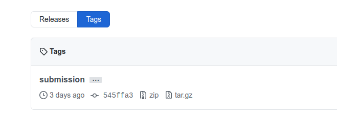

Observe that a tag `submission` is:

- NOT the same as a tag called "`Submission`" (i.e., tags are case-sensitive);
- NOT the same as a _branch_ called "`submission`";
- NOT the same as a _commit message_ "`submission`"; and
- NOT the same as a _release_ called "`submission`".

A tag is a specific point in the repository history, the point you want to be used for marking. A branch, a comment, and a release are different things.

While you can tag from your IDE (e.g., VS Code) you can always resort to command line to first create the tag in your local repo and then push it to the remote:

```shell
git tag -a submission <hash of commit to tag>
git push origin submission
```

By `<hash of commit to tag>`, we mean the 6-8 character hexadecimal string which uniquely identifies a commit.
Check the remote has the tag where you wanted and that it also contains all the commits you did towards the tag!

> [!IMPORTANT]
>
> Before pushing your tag to the remote repo, make sure all the commits you did have already been pushed to the remote too. Check that in the GitHub remote. It is wrong to push just the tag without pushing the actual commits, as it will yield a tag not belonging to any branch history:
>
> 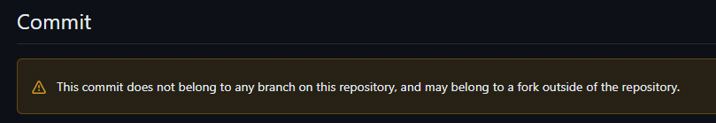

Note that _a tag name can only be used once_, so if you already have a tag `submission` and want to use that tag name on another commit (e.g., you have a better, more recent, commit for your solution), you first need to delete the existing tag; see the next question for that. :-)

- For basic information on tagging, check [here](https://git-scm.com/book/en/v2/Git-Basics-Tagging).
- To create, push, and view tags in GitHub Desktop, check [here](https://docs.github.com/en/desktop/contributing-to-projects/managing-tags).
- To tag via command line or via GitHub web interface, check [here](https://stackoverflow.com/questions/18216991/create-a-tag-in-a-github-repository).

Note that the timestamp of the _commit_ is the submission date.

## How do I change the submission tag if I have already tagged one commit for submission?

This will happen when you realize you have a better version to submit than the one you submitted/tagged before. To do that, you need to first _delete_ the existing tag from both your local repo and from the server:

```shell
git tag --delete <tagname>  # first delete tag in the local repo
git push origin :refs/tags/<tagname>  # then delete remote tag
```

It is important to use `:refs/tags` when deleting the remote tag, as otherwise you may delete the branch with the same name! The empty string to the left of the colon causes the remote reference to be deleted!

Once the tag has been fully deleted, so you can re-use it on another commit!

See this as well on how to _rename_ an existing tag:

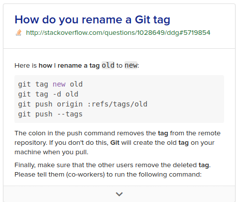

More information on how to delete git tags [here](https://devconnected.com/how-to-delete-local-and-remote-tags-on-git/).

## How do I update the tags in my local repo? I get rejection with "(would clobber existing tag)" message

To fetch the tags in the remote (e.g., tags pushed by other collaborators), you can do:

```shell
git fetch --all --tags -f
```

This will fetch all the changes from the remote, but also all the tags. The `-f` option will replace an existing tag (e.g., `submission`) with the one in the remote, if any (instead of failing). This could come very handy when different collaborators tag and re-tag commits as they incrementally work on a solution.

## Is a tag the same as a release in GitHub?

No, a _tag_ is a _git concept_, whereas a `Release` is something about GitHub, beyond git itself. So, they are not synonymous.

A tag is a _pointer_ to a specific commit, that's all, you basically give a name to a specific commit. This is what we use to mark the commit that is meant to be submitted for marking.

## How can I check which GH username I am using for GitHub Classroom in the course?

The GitHub username you selected is in the name of all of the projects you clone. (e.g. if the repo is called `project-1-search-<username>`, then you used GH `username` account). This is the account with which you should make commits with so we can link them to you through classrooms. You must then have your GIT configuration to commit with such user so that your commits are counted as yours. See [this question](#i-have-committed-to-the-remote-repo-but-i-am-not-listed-as-a-contributor-why) as well.

## My project solution is contained in multiple commits, which do I tag?

The last one.

I think the confusion here is because there are two potentially different things you can mean with the same word commit. You are thinking of commit as a set of changes to files - so the commit itself is only made up of the edits you have made since the last commit. We are thinking of a commit as a _snapshot_ of the entire repository at a point in time, which shows exactly what all the files looked like in the repo in their entirety.

**A commit is both things!** (I will spare you links to documentation to prove it).
As a result, when you commit your final changes to the assignment (even if it is just changing your name in a readme file), and then you tag that commit, we can see all of the files that exist in the repo after you have completed everything. No need to 'recommit' things which you have done before.

To make you comfortable with this, browse around the GitHub page for your project repo. When you make a tag, you should be able to see a link to it, and even download the repo at that tag as a zip file. If you unzip it, you will see the entire repo.

## Problems and issues

### Cannot clone or push to GitHub with my password credentials?

As [per August 12th, 2021 GitHub post](https://github.blog/changelog/2021-08-12-git-password-authentication-is-shutting-down/), GitHub is not no longer accepting account passwords when authenticating Git operations, like cloning private repos or pushing changes. You should use **token-based authentication**, such as  personal access, OAuth, SSH Key, or GitHub App installation token.

So, if you were still using a password to authenticate your GitHub.com operations (something never recommended anyways if you are doing development), you must start using a [personal access token](https://docs.github.com/en/github/authenticating-to-github/keeping-your-account-and-data-secure/creating-a-personal-access-token) by August 13, 2021 via HTTPS (recommended) or [SSH key](https://docs.github.com/en/github/authenticating-to-github/connecting-to-github-with-ssh) to start using a personal access token to avoid disruption.

For example, you can set-up your remote as follows (after you generated your token in GitHub):

```shell
git remote set-url origin https://<token>@github.com/<username>/<repo>
```

As explained [here](https://www.sobyte.net/post/2021-08/github-deprecates-passwords-for-git-operations/), tokens offer many advantages over password-based authentication:

- **Unique:** tokens are specific to GitHub and can be generated on a per-use or per-device basis.
- **Revocable:** tokens can be individually revoked at any time without the need to update unaffected credentials.
- **Limited:** tokens can be narrowed to allow only the access required by the use case.
- **Random:** tokens are not subject to dictionary types or brute force attempts that might be made with simpler passwords that users need to remember or enter periodically.

### I get `Permission denied (publickey).` from GitHub

If yo get this error

```shell
git@github.com: Permission denied (publickey).
fatal: Could not read from remote repository.
```

it most probably mean you have not correctly set-up your ssh keys into GitHub. GitHub needs your ssh public key to know it's you who is trying to access the repo. Please check [here](https://docs.github.com/en/authentication/troubleshooting-ssh/error-permission-denied-publickey).

Setting up GitHub to access with token or ssh is fundamental to have a productive environment, as you will be pushing and pulling from GitHub a lot! 😄

### I have committed to the remote repo but I am not listed as a "contributor", why?

The two main reasons may be:

1. Your commit is in a branch and has not yet made it to the default (master/main) branch, therefore you did not technically contribute (yet).
2. Your local Git commit email isn't connected to your account; [connect it](https://docs.github.com/en/github/setting-up-and-managing-your-github-user-account/managing-email-preferences/setting-your-commit-email-address)!

Read [this GitHub page](https://docs.github.com/en/github/setting-up-and-managing-your-github-profile/managing-contribution-graphs-on-your-profile/why-are-my-contributions-not-showing-up-on-my-profile#common-reasons-that-contributions-are-not-counted) to understand more about why your commit is not yet counting as contributions.

### Commits not correctly associated to my GitHub account, why?

Please [check this](https://docs.github.com/en/github/committing-changes-to-your-project/troubleshooting-commits/why-are-my-commits-linked-to-the-wrong-user) and fix it so we can know the commit was *yous*. Otherwise we may get your contributions wrong and risk getting lower marks or delaying your marking.

Note that when you [set your email address in git in your machine](https://docs.github.com/en/account-and-profile/setting-up-and-managing-your-personal-account-on-github/managing-email-preferences/setting-your-commit-email-address#setting-your-commit-email-address-in-git) you can do it globally, or per repo. The latter would be useful if you are using different GH usernames for different projects/repos (e.g., for different courses, or personal projects).

### I made a bad commit and pushed to repo, how can I undo it?

You should use `git revert`. That is, if you  pushed your changes and you now want to go back to the previous version, use this (assuming you are working on the `main` branch):

```console
git revert HEAD~1
git push origin main
```

This states that you want to revert the changes to `HEAD` by `1` commit (the last commit), make a new commit that undoes those changes, and then push this new commit to the origin branch, in this case the `main` branch. Of course you can imagine how to undo back more than 1 commit, right? 😉

Read more about `git revert` [here](https://www.atlassian.com/git/tutorials/undoing-changes/git-revert).

> [!WARNING]
> _Never ever force push to repo:_ forcing will re-write your repo history and cause serious problems and interferences with our mirroring system.

### We cannot create issues in our group repo from the project board!

When working in teams, [GitHub Projects](https://docs.github.com/en/issues/planning-and-tracking-with-projects/learning-about-projects/about-projects) are an excellent collaboration tool, just fantastic. 👏

The idea is that every (or most) entries in your project board, would probably be issues in your repo.

The first thing you need to do is to make sure the **GitHub Project is linked in the repo**. This will have many benefits, including automatically update of an entry's status in the Project view when the issue's state changes (e.g., from “In progress” to “Done” when issue is closed). This can be done in the `Project` tab of your repo, either by creating the Project from there (best option!) or linking the project. This is how it looks once linked:

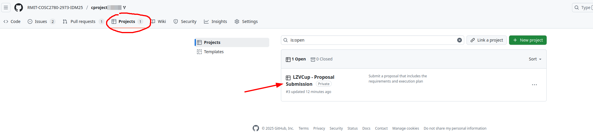

OK, once the project is linked you would be able to:

1. Create an issue in the Project Board (e.g., a new "Backlog" entry that is a newissue)
2. Associate your Project to an issue.

#### Associate your Project to an issue

Let's stat with the second one. On the right hand side of an issue you can pick your project, so that the issue is assigned to the project:

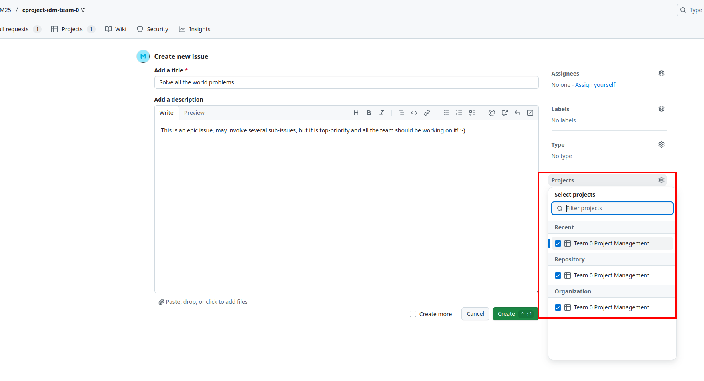

Once the issue is there, you can select and update it's project statuses:

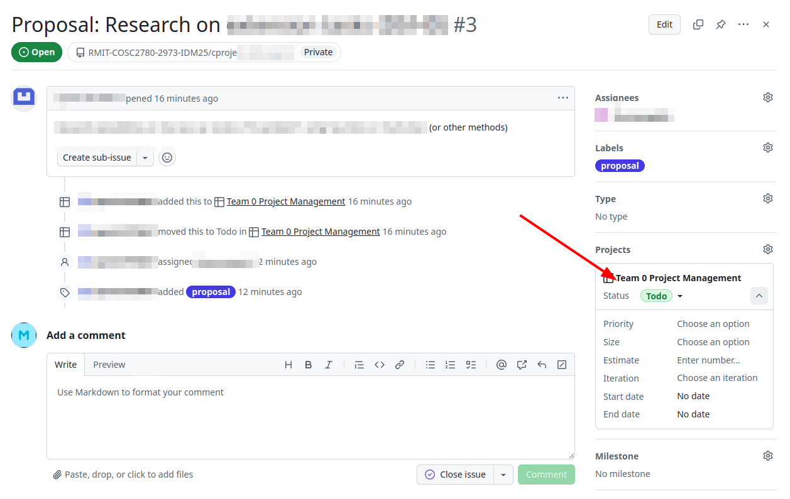

#### Create an issue from the Project Board

Another way to use the project is to add an entry to your project board (e.g., a new "TODO" or "Backlog") and right there make it an issue in your repo.

When you type the description, you will be given the option to either create a new issue or re-use one that exists:

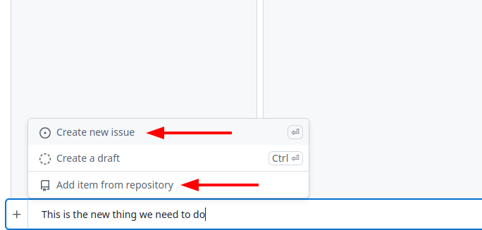

>[!WARNING]
>If you cannot see it the first time you work on the project, type part of your repo name until GH finds it. If still your repo doesn't show up, do at least one issue an link it to the project as explained above. Somehow, GH takes a while to list your repo. But if you search for it typing a few letters, it should come up. 😉 **❗Be very careful not creating the issue in another repo of yours, or in a public repo!** If you do that by mistake, **transfer** it to your project repo (the issue page has a transfer option on the bottom right).

### I can't open a project in VSCode when clicking the button from GitHub

This is often due to a space in a file path on your machine (generally for Windows users), but might have other causes. This button relies on a VSCode extension that is deprecated, so may not be reliable. We strongly encourage all students to clone the repository locally on their machine, and work from there.

## Classroom50

### How do I access Classroom50?

Once you filled the registration form and yo provide us with the GitHub username you will use for the course, we will send you an invite to join the GitHub class organization (`RMIT-COSC1127-3117-AI`) as well as the course you are taking (e.g., AI 20026). 

There are two things that need to be done ONCE:

1. Join the GitHub class organization `RMIT-COSC1127-3117-AI`, by accepting the invite I will send you to your RMIT email.
2. Login for the first time into **Classroom50**, so as to access all projects. This will ask you to authorize Classroom50 as a GitHub Application (just the first time, forever).

This is how the invite for (1) to join the GH Organization will look like:

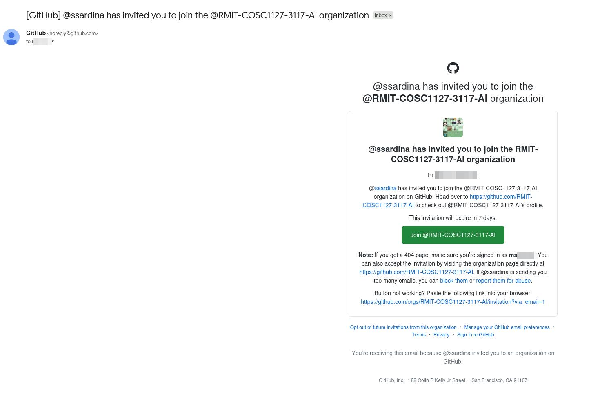

Or if you access `https://github.com/RMIT-COSC1127-3117-AI/` it will show the invite if I have invited you:

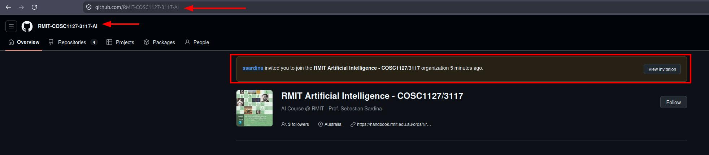

For step (2) to sign-into Classroom50, you will see this when you access the site:

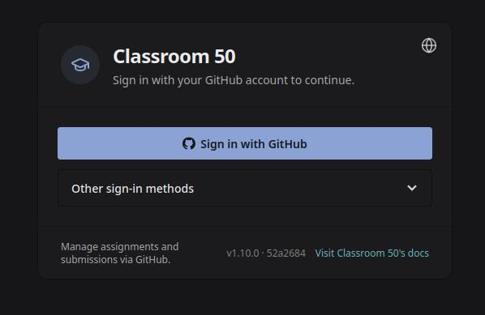

Then, only the first time:

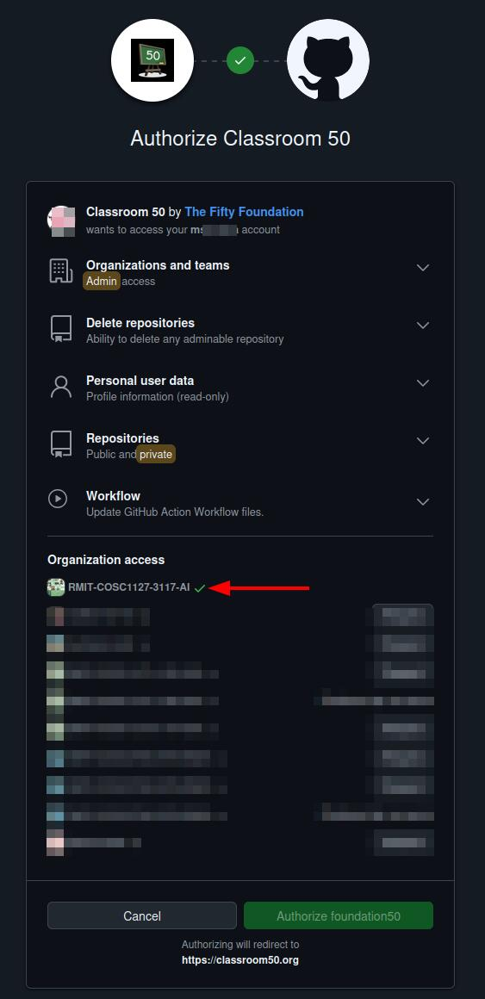


Finally, when you Authorize to access the course GH organization, you will see:

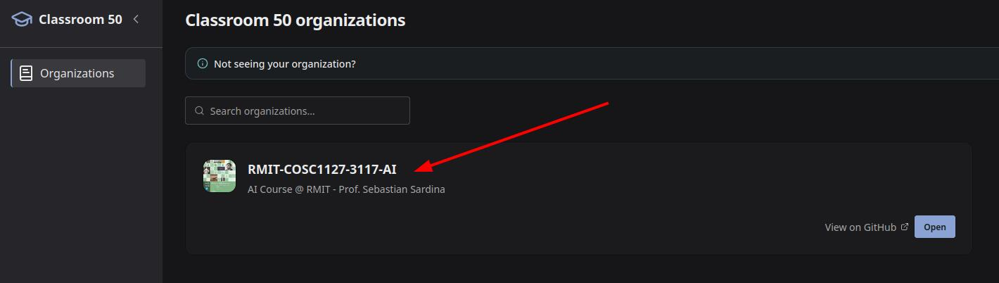

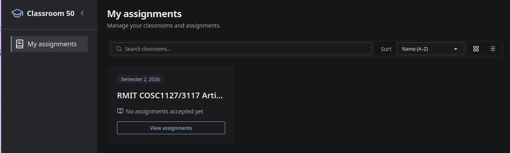

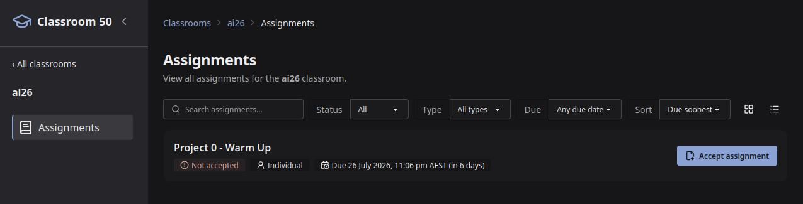

> [!Warning]
> If you have NOT registered, you will NOT get an invite, you will NOT be able to access the projects. Not doing so does NOT warrant an extension or re-submission. With 400+ students to handle we will not be able (and we wouldn't have the bandwidth!) to manually add you to the course if you have not registered; we have scripts and a workflow in place and we cannot do manual setups for anyone. So, please register and follow the instructions to get you on-board ASAP. Thank! 🙏

### My submission does not appear in Classroom50

Our submission process (using the `submission` tag) does not rely on Classroom50, so you can safely ignore it and focus on the **Submission Instructions** in the specification.

Classroom50 is only used for acquiring a copy of the template repository to work on—no marking is done there.

### Classroom50 is blocked

This may be an issue, depending on your ISP. We are unclear on the specifics because we are unable to easily replicate this problem, but it appears that either changing your DNS or accessing Classroom50 via a different network (e.g. the university network) addresses it. Remember that you need only access Classroom50 once per project, to create a copy of the assessment template repository in GitHub.

### Do I need to create a new repository for each project?

**No.** YOU DO NOT CREATE ANY REPO BY YOURSELF. All template repositories are automatically created by our Classrrom50 infrastructure. Any repository that you create without our explicit written permission is not valid and will be deleted by teaching staff.

### Autograding in Classroom50 is failing, what should I do?

Nothing, and never run any workflow as it will use all the credits we have. We are NOT autograding in GitHub at all, all marking is done manually by teaching staff outside GitHub.

You should run the feedback autograding locally in your machine, not in GitHub.