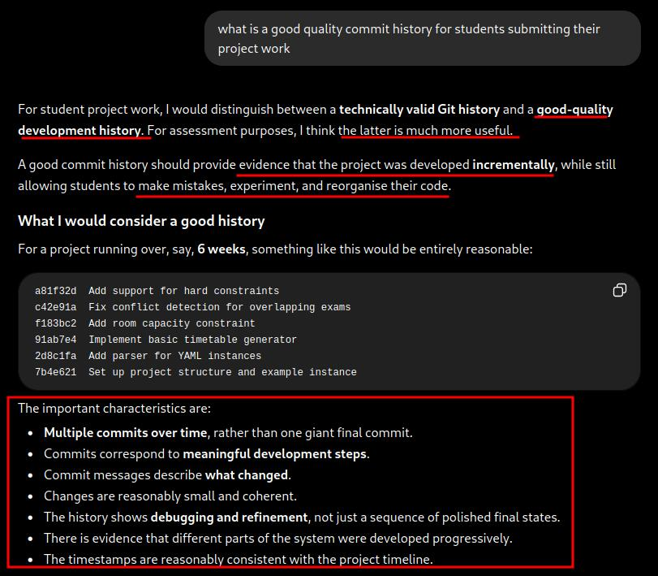
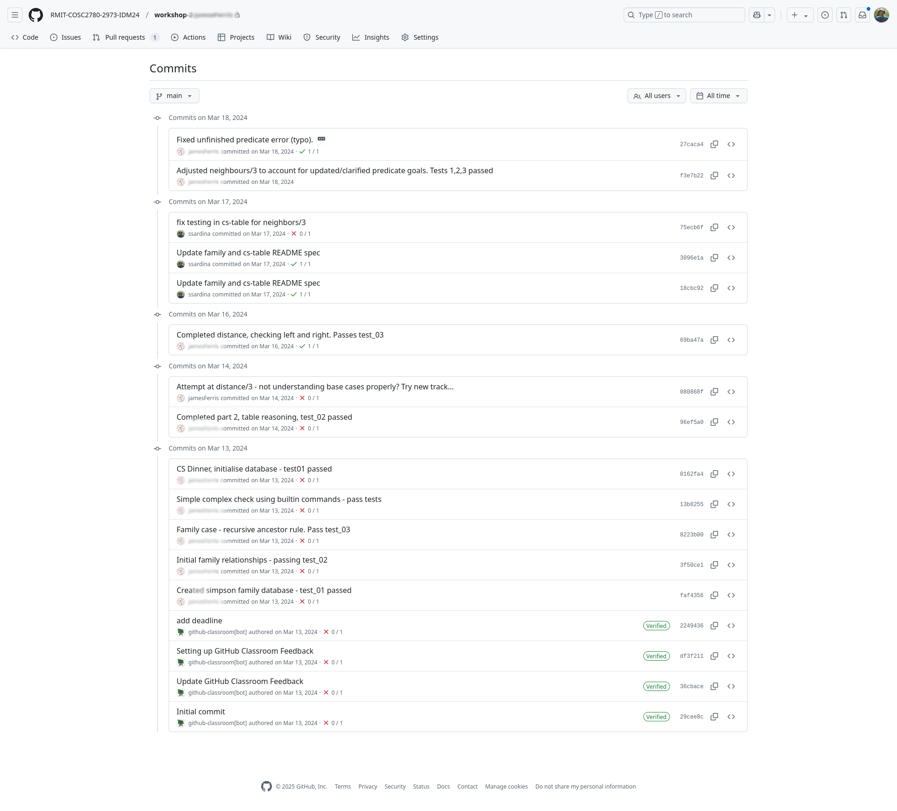
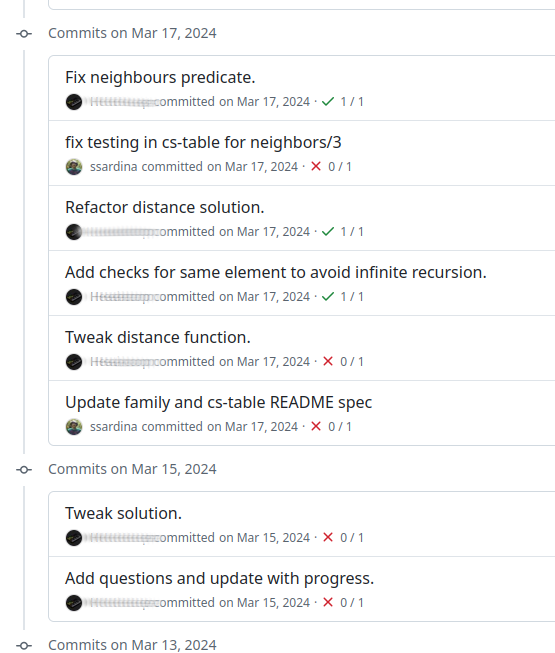
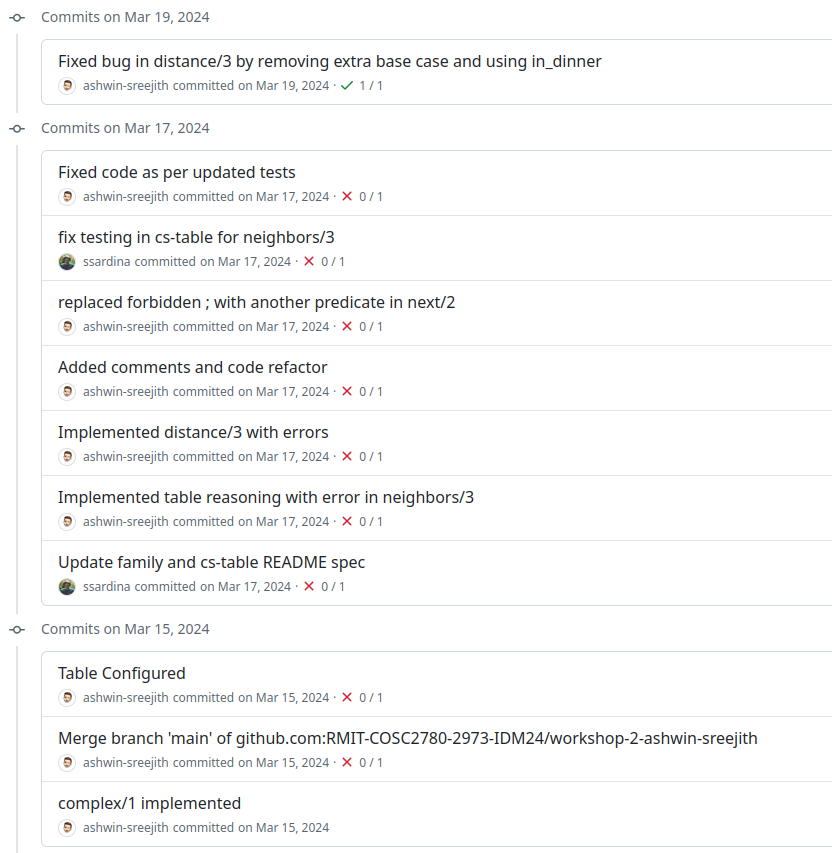
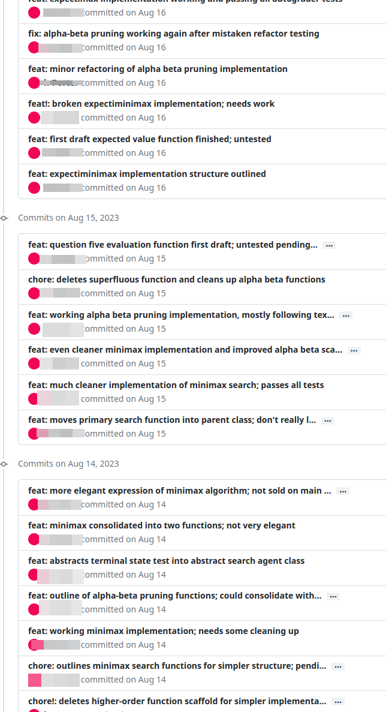
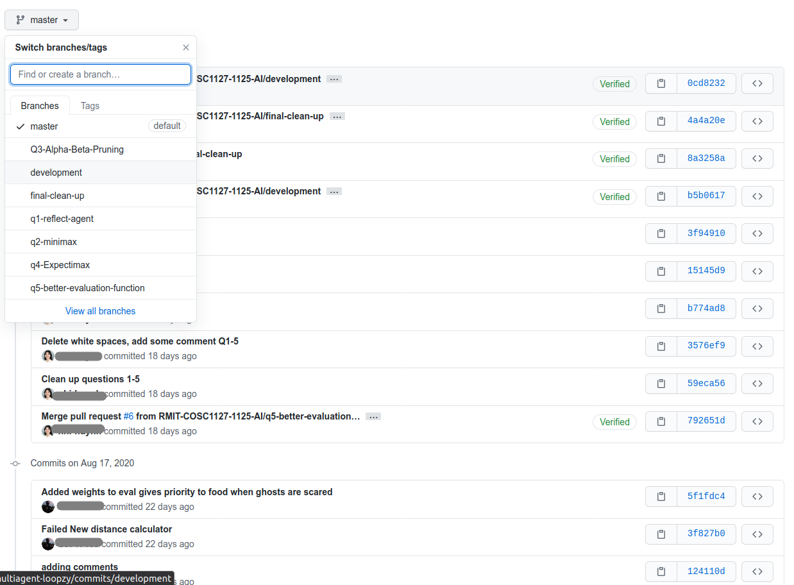

# SE and GIT Best Practices & Expectations

Besides the correctness and performance of your solutions, you _**must**_ **follow good and professional SE practices** in your projects, including good use of git version control and professional communication and team-work during your development.

Overall, you want to generate a meaningful git history that **provides quality evidence of your working towards your solution**. At the bottom you will also find some examples of high-quality git history and management.

> [!Warning]
> Remember this is NOT work, [it is the gym of your brain](https://www.theguardian.com/commentisfree/2026/jul/24/should-you-use-ai) 🏋️ 🧠

Quality development history includes:

1. _**Configure your git authorship**_: set your name and email address correctly so that your commits have correct authorship information. Please access the commit history in your remote repo, and check your commits are linked to the GH username you register in GitHub classroom.
   - Your username in each commit should be the SAME you have linked to your student number in GitHub Classroom in the first cloning, which is the suffix of each repo you clone. For example, if your repo is `https://github.com/RMIT-COSC1127-3117-AI/p0-warmup-ssardina`, then all your commits should be done by GH user `ssardina`.
   - Your username in each commit should be "clickable"; if you cannot click on the user of a commit, then that user is wrongly configured and you must fix it to be clickable.
   - Read about this issues and how to correct them if wrong [here](https://docs.github.com/en/pull-requests/committing-changes-to-your-project/troubleshooting-commits/why-are-my-commits-linked-to-the-wrong-user).
1. _**Commit early, commit often (but meaningfully!)**:_ single or few commits with all the solution or big chunks of it is not good practice.
   - Fixing, improving, optimising, refactorins are all fundamental parts your workings and your git history should reflect all that. Waiting for your solution to work perfectly is wrong as it does not provide _evidence_ of your workings.
1. _**Use atomic logically-separate commits**_: avoid commits about many things or dummy commits; each commit should be about one interesting thing. You want to create a meaningful git history, that allows you to easily revert a past change and show your work towards the final submission. For that, you also don't want to flood your git history with tons of padding un-interesting commits.
   - In general, commit whenever you add a new feature that is worth recording, such as adding a new function, fixing a typo, fixing indentation, optimising a loop, refactoring a section of your code, having a first but not complete approach to your solution, etc. Do not wait to get the complete perfect solution to commit, as soon as the commits are relevant towards your final solution for a task. Do not mix different things in the same commit.
   - Also think about what would happen if my machine breaks down. Will you be regret you haven't commit your latest work? It is not that bad losing 15' work, but it will be losing hours of work. This does not mean committing on a time basis, but doing lots of work without recording it is often bad practice.
1. _**Use meaningful commit messages**_: as comments in your code, a commit message should clearly and succinctly summarise what the commit is about. Messages like "fix", "work", "commit", "changes", "solved", or "search.py" are poor and do not help us understand what was done. Commits with messages like "Q1" , "question q1", or "q1 completed/done" are not good unless the work on the question is trivial. Check the nice posts [“Good Commit” vs “Your Commit”: How to Write a Perfect Git Commit Message](https://www.linkedin.com/pulse/good-commit-vs-your-how-write-perfect-git-victor-timi/) and [Git Best Practices – How to Write Meaningful Commits, Effective Pull Requests, and Code Reviews](https://www.freecodecamp.org/news/git-best-practices-commits-and-code-reviews/).
1. _**Always push (soon!) your commits to remote**_: when you commit you are only changing your local copy in your machine. Only when you push your commits are recorded in your remote repo in GitHub. Do not wait until all is done to push into remote; think what will you do and say if your machine is lost or broken overnight.

You should **never**:

1. _Upload files:_ git should not be used as a storage service. Setup your system to do proper meaningful commits and do not use GitHub's upload button ever.
1. _Download files from GitHub:_ all version control interactions should be via the git standard commands, never use the "Download zip" feature of GitHub. Git and GitHub is not a hard drive, it is a version control system.
1. _Force push to repo:_ forcing will re-write your repo history and cause serious problems and interferences with our mirroring system. Instead use `git revert` to undo a commit by creating another commit. Check the FAQ for projects for more info on `git revert` (or search for it and learn how to use it).
1. _Push a tag without pushing_ all the commits leading to the corresponding commits; otherwise your remote ends up with a tag not associated with any development branch:

    

Besides proper commit behavior to obtain a clean and meaning history, you should also consider the following **if working on non-trivial tasks/projects:**

1. _**Use the Issue Tracker**_: use issues to keep track of tasks, enhancements, and bugs for your projects. They are also a great way to collaborate in a team, by assigning issues and discussing on them directly. Check GitHub [Mastering Issues Guide](https://guides.github.com/features/issues/).
1. _**Follow good workflow and use branches**_: use the standard branch-based development workflow; it will make your team much more productive and robust! Check GitHub [Workflow Guide](https://guides.github.com/introduction/flow/). When merging or re-basing, squash commits _only_ when it will yield a better quality set of commits in the main branch; in general you should avoid squashing (e.g., do not squash commits that are by themselves meaningful).

## Team-based projects

In addition, if **working in groups for a team-based project:**

1. _**Commit evenly across team members**_ (for team project/assignment components). This means there should be meaningful commits from _all_ participating members. Note that [peer programming](https://en.wikipedia.org/wiki/Pair_programming), which we encourage and expect, does _not_ mean one member always or mostly acts as the "driver" and commits. Instead, *all* members should take turns, be the "driver" and commit to the repo.
   - If you are doing peer programming, make sure to _commit with the co-author facility_ (see next point) so that all members of the team get credit for the work.
   - If you are doing peer programming and only one member is the main committer, then that is not good practice and it will be considered that only that member is contributing to the project, which can have a significant impact in the final mark of the project.
   - We will not accept excuses/reasons like _"I was doing peer programming but I forgot to commit"_ or _"I was doing peer programming but I forgot to use the co-author facility"_ or _"My laptop or configuration is not working so we always commit in another member system"_, etc. You must have your set-up correctly configure from day zero, and you must be able to commit and use the co-author facility if doing peer programming. If you have issues with your set-up, you should fix them as soon as possible and not wait until the last minute.
2. **When peer-programming**, you must make use of the [co-author facility](https://docs.github.com/en/github/committing-changes-to-your-project/creating-and-editing-commits/creating-a-commit-with-multiple-authors) in GitHub to be accounted in the contributions. See [this post](https://gitbetter.substack.com/p/how-to-add-multiple-authors-to-a) and [this post](https://github.blog/2018-01-29-commit-together-with-co-authors/) as well about co-authors commits.
   - You can conveniently include multiple co-authors to a commit via GitHub Desktop or via VScode (or otherwise by writing special commit messages) as explained in the links given.
   - Use VSCode extensions like or [Git Mob](https://marketplace.visualstudio.com/items?itemName=RichardKotze.git-mob) or [GitHub Co-Author](https://github.com/rjimenezda/vscode-coauthor) to easily add co-authors to your commits.
   - Use VSCode [Live Share]() to do peer programming remotely and commit together with co-authors in real time.
3. _**Communicate in the GitHub** (Discussions, Issues, Pull Requests, and Projects)_: in team projects, members are expected to communicate and coordinate in an adequate, professional, and efficient manner. In GitHub, teams can use Discussions, Issues and Pull Requests, and Projects within the repo of the project. Video and voice chats outside of GitHub are permissible (e.g., to arrange meetings or support peer programming), but communication and coordination should not be limited to that and they will not be use as evidence of team-work and contributions.
4. _**Use branches and pull requests**_ to manage your development and collaboration.

> [!CAUTION]
> Poor SE and version control practices can have a significant impact in the final mark of an assessment. For example, a single commit with all the solution will attract zero marks overall, even if the solution does perform perfectly. Your commit history shuold reflect and provide unambigous evidence of the process how you arrived to the final product, not just the product.

So, you may ask **_what is the average commits the assignment is expected to have per question?_** There is no "magic" number and is **not** the point to overfit a number no matter what. We will be very reasonable in judging what good process is and we expect you to also have a good judgment of what good development is and what is not, which does not mean to reach a pre-defined number. The number of commits is a proxy, but it is not the end of the story. You can have many commits and still have very poor development. But if the commit number is very low, then it may signal an issue. So, you are also to judge how much work a question involves. If you work on a question for hours and there is only a few commits, then something may be wrong. But, again, the aim of quality development is NOT to overfit a special number of commits.

## Commit history in education setting...

As argued many times, we are not at work, we are in a _learning environment_. See what AI thinkgs about commit history in an educational setting:

 

    

## Sample of great Git management

Here are some examples of high-quality Git history and management:

 

    
    
    
    
    
    
 

